データ基盤の構築に携わっていると、**dbt（data build tool）** という名前を耳にする機会がますます増えてきました。

dbtは一言で言うと、**SQLを書くだけでデータ変換パイプラインを構築できるツール** です。DWH（データウェアハウス）やクエリエンジン上のデータを、SQLベースで変換・テスト・ドキュメント化する一連のワークフローを支えてくれます。

:::message
この記事では、dbtの概要から実務でのシステム構成、主要コマンド、そして実際のモデルの書き方まで、図解を交えて体系的に解説します。
dbtの前提知識として、メダリオンアーキテクチャ（Bronze / Silver / Gold 層）の概念を理解していると読みやすいです。
:::

https://zenn.dev/kkoch5t2/articles/a74e0b8c0c0e30

## dbtとは

dbtは、**ELT（Extract / Load / Transform）パイプラインの「T（Transform）」に特化したオープンソースのデータ変換ツール** です。

データ基盤における「変換（Transform）」とは、DWHにロードされた生データをクレンジング・結合・集計して、分析に使える形に加工する工程のことです。dbtはこの工程を、SQLとYAMLの設定ファイルだけで完結させます。

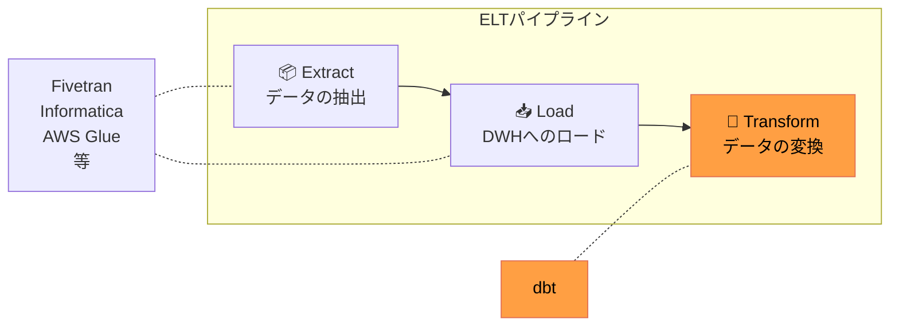

ここで重要なのは、dbtは **Extract（抽出）や Load（ロード）は担当しない** という点です。データをソースシステムからDWHに運ぶ（データ抽出・ロード）のは、Informatica、AWS Glue、Azure Data Factoryなどの外部ツールの仕事です。dbtは「DWHに入った後のデータを変換する」ことだけに集中します。

## dbtの仕組み

### dbt自体は計算しない

dbtを理解するうえで最も重要なポイントは、**dbt自体はデータの計算・処理を一切行わない** ということです。

dbtがやっていることは、SQLテンプレートから最終的なSQLを組み立てて、接続先のDWH（Snowflake、BigQuery等）やクエリエンジン（Amazon Athena等）に「投げる」だけです。実際のデータ処理（WHERE句のフィルタリング、JOINの実行、GROUP BYの集計等）はすべてDWH / クエリエンジン側で行われます。

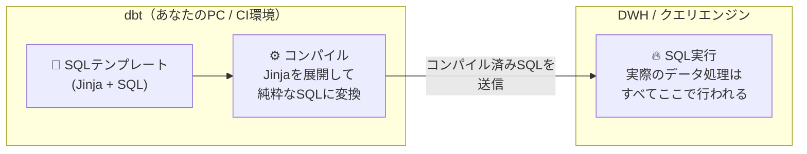

:::message
メダリオンアーキテクチャの記事でも補足しましたが、dbtはあくまで「SQLを組み立てて投げるツール」です。この点が、自らデータを分散処理するSpark等のフレームワークとの根本的な違いです。
:::

### Jinja + SQL のテンプレートエンジン

dbtでは、素のSQLではなく **Jinja（ジンジャ）テンプレート** を使ってSQLを記述します。Jinjaとは、Pythonで広く使われるテンプレートエンジンです。

これにより、変数の展開、条件分岐、ループといったロジックをSQL内に埋め込めるようになります。中でも最も重要なのが、dbtが提供する **`ref()` 関数** と **`source()` 関数** です。

```sql
-- models/marts/fct_daily_sales.sql

SELECT
    date_trunc('day', o.ordered_at) AS order_date,
    COUNT(*) AS total_orders,
    SUM(o.amount) AS total_revenue
FROM {{ ref('stg_orders') }} AS o  -- 👈 ref() で他のモデルを参照
GROUP BY 1
```

上記のdbtモデルをコンパイル（純粋なSQLに変換）すると、`{{ ref('stg_orders') }}` は設定ファイルの情報をもとに、**現在実行している環境の実際のテーブル名（データベース名.スキーマ名.テーブル名）** に自動で展開されます。

例えば、「本番環境（prod）」と「開発環境（dev）」でそれぞれ以下のように設定されているとします。

**実際のデータ例（設定と展開結果）**
| 実行環境 | データベース名 | スキーマ名 | `{{ ref('stg_orders') }}` が展開される文字列 |
|---|---|---|---|
| **prod（本番）** | `analytics_db` | `marts` | `analytics_db.marts.stg_orders` |
| **dev（開発）** | `dev_db` | `dbt_alice` | `dev_db.dbt_alice.stg_orders` |

この仕組みにより、開発環境と本番環境で実行した場合、コンパイル後のSQLはそれぞれ以下のように切り替わります。

```sql
-- ① 開発環境で実行した場合のコンパイル結果
SELECT
    date_trunc('day', o.ordered_at) AS order_date,
    COUNT(*) AS total_orders,
    SUM(o.amount) AS total_revenue
FROM dev_db.dbt_alice.stg_orders AS o  -- 👈 開発環境用のテーブル名に展開！
GROUP BY 1

-- ② 本番環境で実行した場合のコンパイル結果
SELECT
    date_trunc('day', o.ordered_at) AS order_date,
    COUNT(*) AS total_orders,
    SUM(o.amount) AS total_revenue
FROM analytics_db.marts.stg_orders AS o  -- 👈 本番環境用のテーブル名に展開！
GROUP BY 1
```

SELECT句や集計ロジックなどの**SQL本体は全く同じまま、FROM句のテーブル名だけが環境に合わせて自動で書き換わっている**点に注目してください。

このように、`ref()` を使うことで、**SQLのロジックを一切書き換えることなく、「本番実行時は本番データを」「開発時は開発用のテストデータを」自動的に向いてくれる** のが大きなメリットです。手作業でテーブル名を `dev_~` に書き換える手間や、間違えて本番データを参照してしまう事故を防ぐことができます。

### ref() による依存関係の自動解決

`ref()` 関数の真価は、単なるテーブル名の置換ではなく、**モデル間の依存関係を自動で解決してくれる** ところにあります。

dbtは、すべてのモデルの `ref()` を解析して、**DAG（有向非巡回グラフ）** という依存関係のグラフを自動生成します。これにより、どのモデルをどの順番で実行すべきかをdbtが自動で判断してくれます。

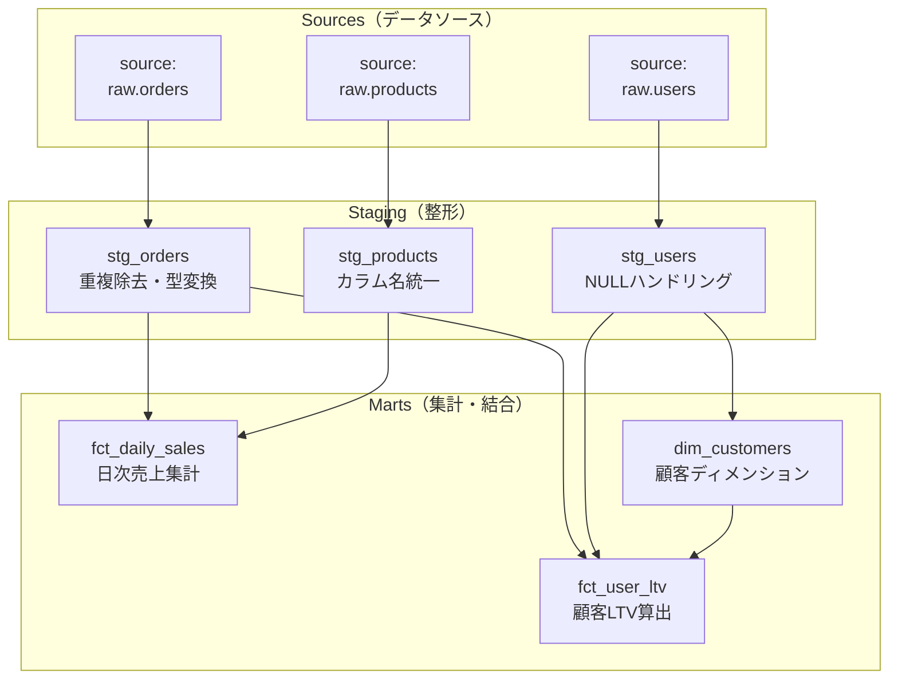

上の図で言えば、`fct_daily_sales` は `stg_orders` と `stg_products` に依存しています。dbtはこの関係を自動で把握し、`stg_orders` → `stg_products` → `fct_daily_sales` の順に実行します（依存関係がないモデル同士は並列実行も可能です）。

:::message
**DAGの自動生成が嬉しい理由**
単に画面で結果を見るだけのSELECTクエリなら実行順序は関係ありません。しかし、データ基盤のバッチ処理では、これらのSELECT文を `CREATE TABLE`（DDL）や `INSERT / MERGE`（DML）といった**データ更新処理**に変換して実行します。
もし上流のテーブルの更新（INSERT等）が終わる前に下流のテーブルを更新してしまうと、古いデータで集計されたり、テーブルが存在せずにエラーになったりします。dbtの `ref()` を使えば、この **「データ更新（DML/DDL）を安全に行うための正しい実行順序」** をdbtが自動で守ってくれるため、手動での順序管理による事故を根絶できます。
:::

### source() 関数

`source()` 関数は、dbtの管理外にある「生テーブル（dbt外のデータ統合ツールがロードしたテーブル）」を参照するための関数です。`ref()` がdbtモデル間の参照に使われるのに対し、`source()` はdbtの外からやってくるデータの入口を明示します。

```sql
-- models/staging/stg_orders.sql

SELECT
    order_id,
    user_id,
    CAST(amount AS INTEGER) AS amount,
    CAST(created_at AS TIMESTAMP) AS ordered_at
FROM {{ source('raw', 'orders') }}  -- 👈 source() でデータ統合ツールが入れた生テーブルを参照
WHERE order_id IS NOT NULL
```

ソースの定義は、YAMLファイルで行います。

```yaml
# models/staging/_sources.yml

version: 2

sources:
  - name: raw
    database: analytics
    schema: raw
    tables:
      - name: orders
        description: "ECサイトの注文データ（外部ツールが日次でロード）"
      - name: users
        description: "ユーザーマスタデータ"
      - name: products
        description: "商品マスタデータ"
```

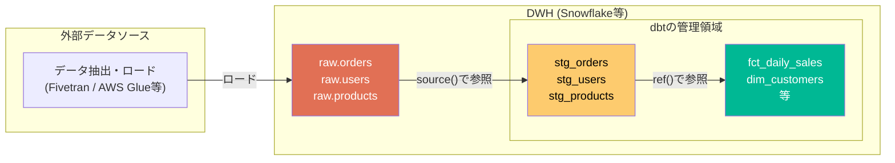

## dbtのプロジェクト構造

dbtプロジェクトのディレクトリ構成は、以下のような形が一般的です。

```
my_dbt_project/
├── dbt_project.yml          # プロジェクト全体の設定
├── profiles.yml             # DB接続情報（ローカル開発時）
├── models/
│   ├── staging/             # ステージングモデル（Silver層に相当）
│   │   ├── _sources.yml     #   ソース定義
│   │   ├── _stg_models.yml  #   モデルのスキーマ定義・テスト
│   │   ├── stg_orders.sql
│   │   ├── stg_users.sql
│   │   └── stg_products.sql
│   └── marts/               # マートモデル（Gold層に相当）
│       ├── _mart_models.yml #   モデルのスキーマ定義・テスト
│       ├── fct_daily_sales.sql
│       ├── dim_customers.sql
│       └── fct_user_ltv.sql
├── tests/                   # カスタムテスト（SQLベース）
├── macros/                  # 再利用可能なSQL関数（Jinjaマクロ）
├── seeds/                   # CSVデータ（マスタ等の小規模な静的データ）
├── snapshots/               # SCD Type 2（履歴追跡）用のスナップショット
└── target/                  # コンパイル済みSQL（自動生成、Git管理外）
```

### 主要ファイルの役割

| ファイル / ディレクトリ | 役割 |
|---|---|
| **`dbt_project.yml`** | プロジェクト名、モデルのマテリアライゼーション設定（view / table / incremental）等を定義 |
| **`profiles.yml`** | DWHへの接続情報（ホスト・認証情報・スキーマ等）を定義。dbt Cloudでは不要 |
| **`models/`** | SQLモデル（データ変換のロジック）とYAMLスキーマ定義の格納場所 |
| **`tests/`** | SQLで書くカスタムテスト。YAMLで定義するスキーマテストでは表現しきれないビジネスルールを検証 |
| **`macros/`** | 複数モデルで使い回すSQLロジックをJinjaマクロとして定義 |
| **`seeds/`** | 小規模なCSVファイル。国コードや商品カテゴリのマッピングテーブル等に使う |
| **`snapshots/`** | ソーステーブルの変更履歴を追跡（SCD Type 2）するための定義 |
| **`target/`** | `dbt compile` や `dbt run` で生成されるコンパイル済みSQL。`.gitignore` に追加してGit管理外にする |

### マテリアライゼーション

dbtにおける「マテリアライゼーション（Materialization）」とは、 **dbtで書いたモデル（SELECT文）の結果を、DWH上にどのような形で出力・保存するかという設定（保存形式）** のことです。
SQLのロジックは一切変えずに、設定ファイル（またはSQLファイルの冒頭）の記述をひとつ変えるだけで、「単なるビューとして定義する」か「物理的なテーブルとして保存する」か等の保存方法を簡単に切り替えられるのが大きな特徴です。

| マテリアライゼーション | 動作 | 適した用途 |
|---|---|---|
| **`view`** | ビューとして作成（データは保持しない） | ステージングモデル等、データ量が少なくクエリ頻度も低いもの |
| **`table`** | テーブルとして実体化（毎回フルリフレッシュ） | データ量が中程度のマートモデル |
| **`incremental`** | 差分のみ追記・更新（初回はフルロード） | 大量データの日次バッチ処理。ログデータやトランザクションデータ |
| **`ephemeral`** | テーブルもビューも作らず、CTEとして他モデルに埋め込まれる | 中間計算用。DWH上にオブジェクトを増やしたくない場合 |

:::message
**dbtの基本思想（フルリフレッシュ）と裏側で実行されるSQL**
dbtは安全性を担保するため、 **「毎回データをまるごと作り直す（フルリフレッシュ）」** のが大前提のツールです。設定によって、裏側で発行されるSQLが以下のように切り替わります。

- **`table` / `view` （まるごと再作成）**
  毎回 **`CREATE OR REPLACE`** 等が実行され、テーブルやビューをゼロから新しく作り直します。何度エラーで再実行してもデータが二重登録されず、常に同じ正しい状態になる（**冪等性が担保される**）ため、最も安全な基本設定です。
- **`incremental` （差分更新）**
  全件洗い替えでは時間とコストがかかりすぎる巨大データ（ログ等）にのみ使う特例措置です。初回のみ `CREATE` され、2回目以降は **`INSERT` や `MERGE (UPDATE + INSERT)`** が実行されて新しいデータだけが追記・更新されます。
- **`ephemeral` （一時的な切り出し）**
  DWH上に実体は作られず、dbtが自動的に **`WITH ~ AS (...)` （CTE）** に変換し、他のSQL文に埋め込みます。SQLが長すぎる時のファイル分割に便利です。
:::

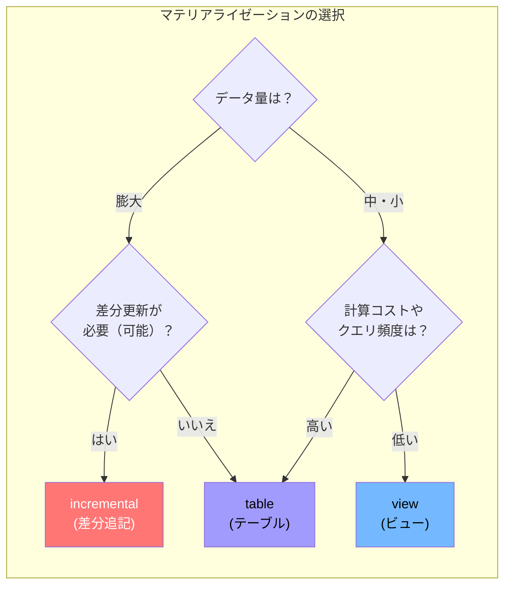

`dbt_project.yml` でプロジェクト全体のデフォルトを設定し、個別のモデルでオーバーライドするのが一般的です。

```yaml
# dbt_project.yml

name: 'my_project'
version: '1.0.0'

models:
  my_project:
    staging:
      +materialized: view       # staging配下はビュー
    marts:
      +materialized: table      # marts配下はテーブル
```

```sql
-- models/marts/fct_daily_sales.sql
-- モデル単位でオーバーライドもできる
-- （※ここで前述したマテリアライゼーションの 'incremental'（差分更新）を指定しています）
{{ config(materialized='incremental', unique_key='order_date') }}

SELECT
    date_trunc('day', ordered_at) AS order_date,
    COUNT(*) AS total_orders,
    SUM(amount) AS total_revenue
FROM {{ ref('stg_orders') }}


    -- 差分更新：前回実行以降のデータのみ処理
    WHERE ordered_at > (SELECT MAX(ordered_at) FROM {{ this }})


GROUP BY 1
```

## 実務でよく使うシステム構成

dbtは「SQLを投げるだけ」のツールなので、実際のデータ処理を行うDWH / クエリエンジンとセットで構成されます。ここでは、実務でよく見る代表的な構成パターンを紹介します。

### 前提：dbt Core と dbt Cloud の違い

システム構成を考える上で、まず **「dbt本体をどこで動かすか」** について2つの選択肢を知っておく必要があります。

1. **dbt Core（OSS版・無料）**
   - パソコンの黒い画面（ターミナル）でコマンドを叩いて実行するオープンソース版。
   - 本番環境で毎日自動実行させるためには、GitHub ActionsやApache Airflowなどの「ジョブ管理（ワークフロー）ツール」を自前で用意して組み合わせる必要があります。
2. **dbt Cloud（SaaS版・有料）**
   - ブラウザ上でコードの開発からテスト、さらには本番環境での定期実行（ジョブ管理）まで全て完結できるマネージドサービス。
   - 自前で実行環境（インフラ）を用意する手間が一切省けるため、導入ハードルが低いのが特徴です。

実務では、コストを抑えたい場合やすでに自社でAirflow等の基盤を持っている場合は `dbt Core`、インフラ管理の手間をお金で解決して爆速で立ち上げたい場合は `dbt Cloud` が選ばれる傾向にあります。

### 構成①：dbt Core + モダンDWH（Snowflake / BigQuery等）

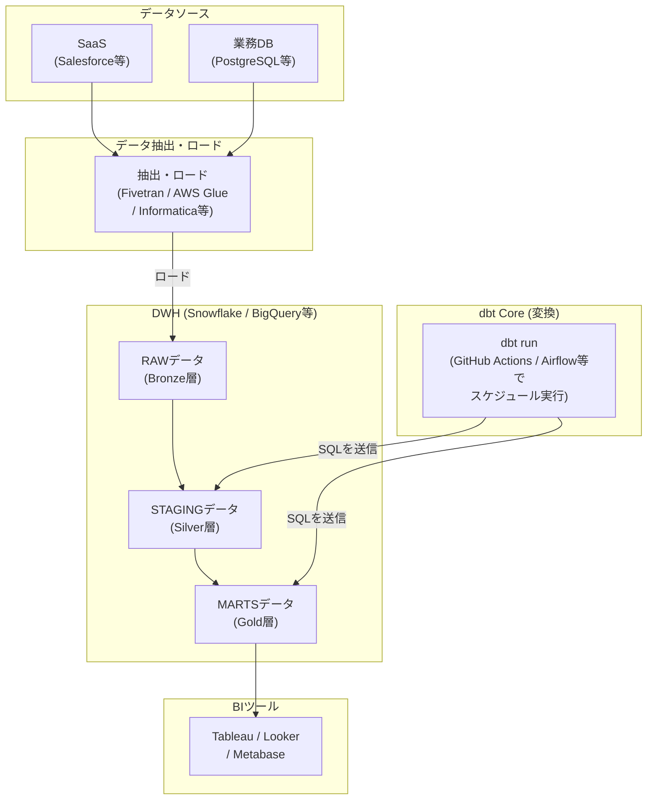

最もポピュラーな構成です。dbt Coreをローカル環境やCI/CD（GitHub Actions等）から実行し、SnowflakeやBigQuery等のDWH上でSQLを処理させます。

| 項目 | 内容 |
|---|---|
| **dbtの実行環境** | ローカルPC / GitHub Actions / Airflow等 |
| **DWH** | Snowflake / BigQuery / Redshift等 |
| **データ抽出・ロード** | Fivetran / Informatica / AWS Glue / Azure Data Factory 等 |
| **スケジューリング** | GitHub ActionsのCron / Airflow / Dagster等 |

### 構成②：dbt Cloud（フルマネージド）

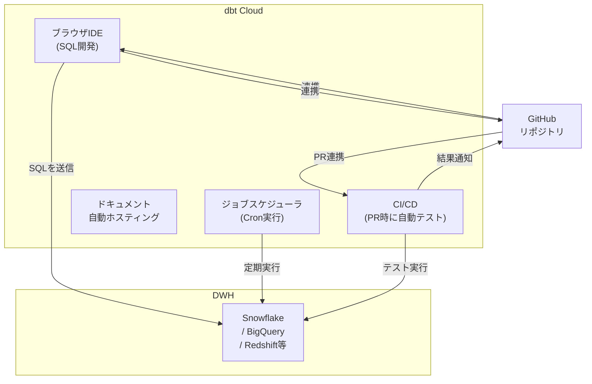

dbt Cloudは、dbt Labsが提供するフルマネージドのSaaS環境です。ブラウザ上のIDEでのSQL開発、ジョブスケジューリング、CI/CD、ドキュメントホスティングなど、dbt Coreでは別途構築が必要な機能がすべて統合されています。

### dbt Core vs dbt Cloud

| 比較項目 | dbt Core | dbt Cloud |
|---|---|---|
| **コスト** | 無料（OSS） | 有料（チーム規模で課金） |
| **実行環境** | 自前で用意（ローカル / CI / Airflow等） | dbt Labs が提供（ブラウザIDE） |
| **スケジューリング** | 別途構築（GitHub Actions / Airflow等） | 組み込み済み |
| **CI/CD** | 別途構築 | GitHub PR連携が組み込み済み |
| **ドキュメント** | `dbt docs generate` + 自前ホスティング | 自動ホスティング |
| **向いているケース** | 既存のオーケストレーション基盤がある / コスト重視 | 素早く立ち上げたい / インフラ管理を減らしたい |

## よく使うコマンド

### 基本コマンド一覧

| コマンド | 役割 |
|---|---|
| **`dbt run`** | モデルを実行（SQLをDWHに投げてテーブル/ビューを作成） |
| **`dbt build`** | モデルの実行 + テスト + スナップショット + シードを依存順にすべて実行 |
| **`dbt test`** | テスト（スキーマテスト + カスタムテスト）のみを実行 |
| **`dbt compile`** | Jinjaテンプレートをコンパイルして純粋なSQLに変換（実行はしない） |
| **`dbt debug`** | DWHへの接続確認・設定ファイルのバリデーション |
| **`dbt seed`** | `seeds/` 配下のCSVファイルをDWHにロード |
| **`dbt docs generate`** | ドキュメントサイトのHTML/JSONを生成 |
| **`dbt docs serve`** | 生成したドキュメントをローカルサーバーで表示 |
| **`dbt snapshot`** | スナップショット（SCD Type 2）を実行 |
| **`dbt clean`** | `target/` 等の生成物を削除 |

### コマンドの実行フロー

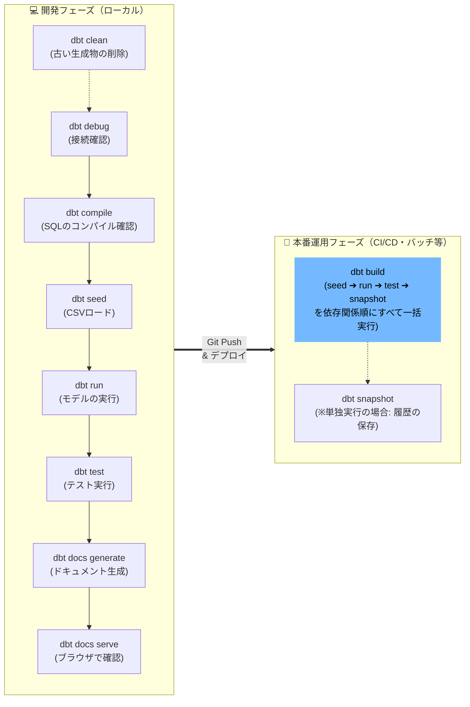

:::message
**本番環境では `dbt build` が便利**
開発時は上記のように順番にコマンドを叩いて確認することが多いですが、本番環境のバッチ処理などでは **`dbt build`** コマンドを1つ叩くだけで、②〜④（seed ➔ run ➔ test ➔ snapshot）を依存関係の順序通りにすべて一括で実行してくれます。
:::

### --select オプションで部分実行

モデルが増えてくると、全モデルの実行は時間がかかります。`--select`（短縮形 `-s`）オプションを使うと、特定のモデルだけを選択して実行できます。
※ `--select` 自体が何か特別な処理（CREATE文の発行など）を行うわけではなく、あくまで「`dbt run` や `dbt test` の対象となるモデルを絞り込む」ためのフィルターとして機能します。

```bash
# 特定のモデルだけ実行
dbt run --select stg_orders

# 特定のディレクトリ配下をすべて実行
dbt run --select staging.*

# 特定のモデルとその下流（依存先）をすべて実行
dbt run --select stg_orders+

# 特定のモデルとその上流（依存元）をすべて実行
dbt run --select +fct_daily_sales

# 特定のモデルの上流・下流すべて実行
dbt run --select +stg_orders+

# タグで絞り込み
dbt run --select tag:daily
```

:::message
**ノード選択の特殊記号（Graph operators）について**
`--select` オプションでは、モデル名だけでなく特殊な記号を組み合わせて柔軟に実行範囲を指定できます。
- **`+`（プラス記号）**: 依存関係（DAG）を辿ります。モデル名の**前**につける（`+model`）と「そのモデルとすべての**上流**（親）」を、モデル名の**後**につける（`model+`）と「そのモデルとすべての**下流**（子）」を含めて実行します。
- **`.*`（アスタリスク）**: ワイルドカードです。`ディレクトリ名.*` のように書くことで、特定のフォルダ配下にあるモデルをまるごと一括指定できます。
- **`tag:`（プレフィックス）**: `tag:daily` のように書き、モデルに付与した特定のタグを条件にして実行範囲を絞り込めます。
:::

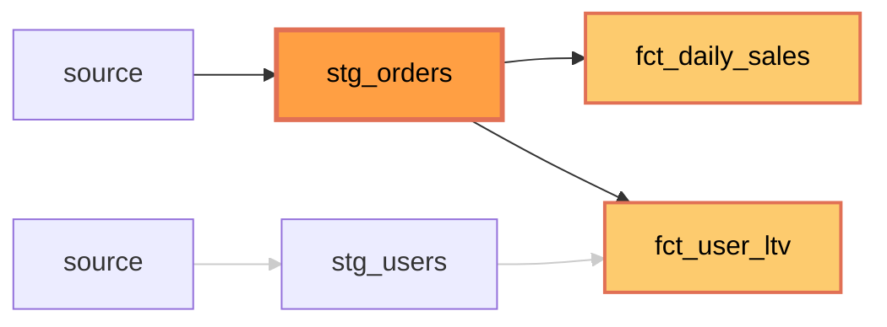

上の図は `dbt run --select stg_orders+` を実行した場合のイメージです。`stg_orders`（オレンジ）とその下流（黄色）が実行対象になり、関係のない `stg_users` は実行されません。

### 実務でよく使うコマンドパターン

```bash
# ① 開発中：変更したモデルだけ素早く実行・テスト
dbt run --select stg_orders
dbt test --select stg_orders

# ② 開発中：コンパイルだけして、生成されるSQLを確認
dbt compile --select fct_daily_sales
# → target/compiled/ 配下に生成されたSQLを確認

# ③ 本番：すべてのモデルを依存順に実行 + テスト
dbt build

# ④ 本番：特定のディレクトリ配下だけ実行 + テスト
dbt build --select marts.*

# ⑤ 特定モデルを除外して実行
dbt run --exclude stg_legacy_orders

# ⑥ フルリフレッシュ（incrementalモデルを初回から作り直す）
dbt run --full-refresh --select fct_daily_sales
```

:::message
**`dbt run` と `dbt build` の使い分け**
- **`dbt run`**：モデルの実行のみ。テストは別途 `dbt test` で実行する必要がある
- **`dbt build`**：モデルの実行 + テスト + シード + スナップショットを、依存関係に沿ってすべて実行する。本番のバッチジョブではこちらを使うのが一般的

`dbt build` を使うと「テストが失敗したモデルの下流は実行しない」というフェイルセーフが自動的に働くため、不正なデータが下流に流れるリスクを防げます。
:::

## モデルの書き方（実践）

ここからは、dbtモデルの具体的な書き方を実践的に解説します。


### ステージングモデル（stg_）

ステージングモデルは、ソースの生テーブルを**1対1で**クレンジング・整形するモデルです。メダリオンアーキテクチャにおけるSilver層に相当します。

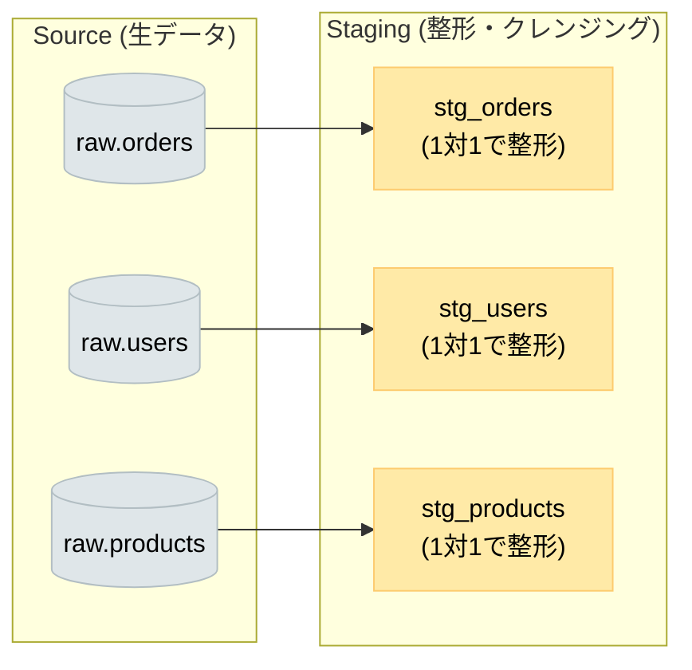

```sql
-- models/staging/stg_orders.sql

WITH source AS (
    -- source() でELツールがロードした生テーブルを参照
    SELECT * FROM {{ source('raw', 'orders') }}
),

cleaned AS (
    SELECT
        -- カラム名の統一（スネークケースに）
        order_id,
        user_id,

        -- 型変換（文字列 → 数値）
        CAST(amount AS INTEGER) AS amount,

        -- 型変換（文字列 → タイムスタンプ）
        CAST(created_at AS TIMESTAMP) AS ordered_at,

        -- NULLの補完
        COALESCE(status, 'unknown') AS status

    FROM source

    -- 重複除去
    QUALIFY ROW_NUMBER() OVER (
        PARTITION BY order_id ORDER BY created_at DESC
    ) = 1
)

SELECT * FROM cleaned
```

```sql
-- models/staging/stg_users.sql

WITH source AS (
    SELECT * FROM {{ source('raw', 'users') }}
),

cleaned AS (
    SELECT
        user_id,
        CAST(age AS INTEGER) AS age,
        COALESCE(gender, 'unknown') AS gender,
        CAST(registered_at AS TIMESTAMP) AS registered_at
    FROM source
)

SELECT * FROM cleaned
```

```sql
-- models/staging/stg_products.sql

WITH source AS (
    SELECT * FROM {{ source('raw', 'products') }}
),

cleaned AS (
    SELECT
        product_id,
        category,
        CAST(price AS INTEGER) AS price
    FROM source
)

SELECT * FROM cleaned
```

**ステージングモデルの原則：**
- ソーステーブルと **1対1** で対応させる（JOINしない）
- 行うのは型変換、リネーム、NULLハンドリング、重複除去などの **軽いクレンジングのみ**
- ビジネスロジック（集計、結合）は入れない

### マートモデル（fct_ / dim_）

マートモデルは、ステージングモデルを結合・集計して、ビジネスユーザーが直接利用するテーブルを作るモデルです。メダリオンアーキテクチャにおけるGold層に相当します。

命名規則として、以下の接頭辞がよく使われます。

| 接頭辞 | 種類 | 内容 |
|---|---|---|
| **`fct_`** | ファクトテーブル | ビジネスイベント（注文、PV等）の数値データ |
| **`dim_`** | ディメンションテーブル | マスタデータ（顧客、商品等）の属性情報 |

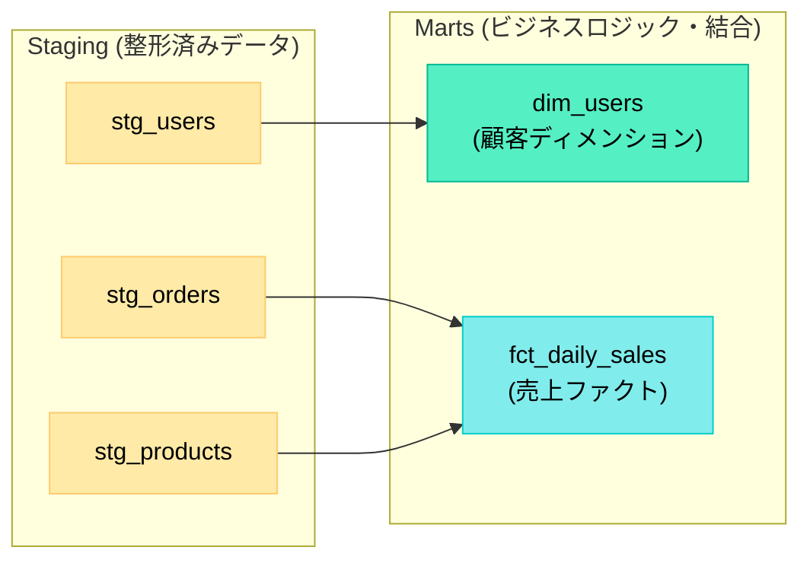

```sql
-- models/marts/fct_daily_sales.sql
-- ※ materialized='incremental' を指定することで差分更新モードになります
{{ config(materialized='incremental', unique_key='order_date') }}

WITH orders AS (
    SELECT * FROM {{ ref('stg_orders') }}
),

products AS (
    SELECT * FROM {{ ref('stg_products') }}
)

SELECT
    DATE_TRUNC('day', o.ordered_at) AS order_date,
    p.category AS product_category,
    COUNT(*) AS total_orders,
    SUM(o.amount) AS total_revenue,
    AVG(o.amount) AS avg_order_value
FROM orders AS o
LEFT JOIN products AS p ON o.product_id = p.product_id


    WHERE o.ordered_at > (SELECT MAX(ordered_at) FROM {{ this }})


GROUP BY 1, 2
```

:::message
**incrementalモデルにおける `unique_key` とは？**
`config(materialized='incremental', unique_key='order_date')` で指定している `unique_key` は、**「既存のデータと新しいデータをどうやって紐付ける（同一視する）か」** をdbtに教えるための設定です。
これを指定しておくと、dbtは裏側で単なる `INSERT` ではなく `MERGE`（UPSERT処理）を実行してくれます。つまり、「すでに同じ日付（`order_date`）のデータが存在する場合は上書き（UPDATE）、存在しない場合は追記（INSERT）」してくれるため、データが二重に登録されてしまうのを防ぐことができます。
:::

```sql
-- models/marts/dim_customers.sql

WITH users AS (
    SELECT * FROM {{ ref('stg_users') }}
),

orders AS (
    SELECT * FROM {{ ref('stg_orders') }}
),

customer_stats AS (
    SELECT
        user_id,
        COUNT(*) AS total_orders,
        SUM(amount) AS lifetime_value,
        MIN(ordered_at) AS first_order_at,
        MAX(ordered_at) AS last_order_at
    FROM orders
    GROUP BY 1
)

SELECT
    u.user_id,
    u.user_name,
    u.email,
    u.registered_at,
    COALESCE(cs.total_orders, 0) AS total_orders,
    COALESCE(cs.lifetime_value, 0) AS lifetime_value,
    cs.first_order_at,
    cs.last_order_at
FROM users AS u
LEFT JOIN customer_stats AS cs ON u.user_id = cs.user_id
```

### メダリオンアーキテクチャとの対応関係

dbtのモデル構造と、メダリオンアーキテクチャの3層は以下のように対応します。

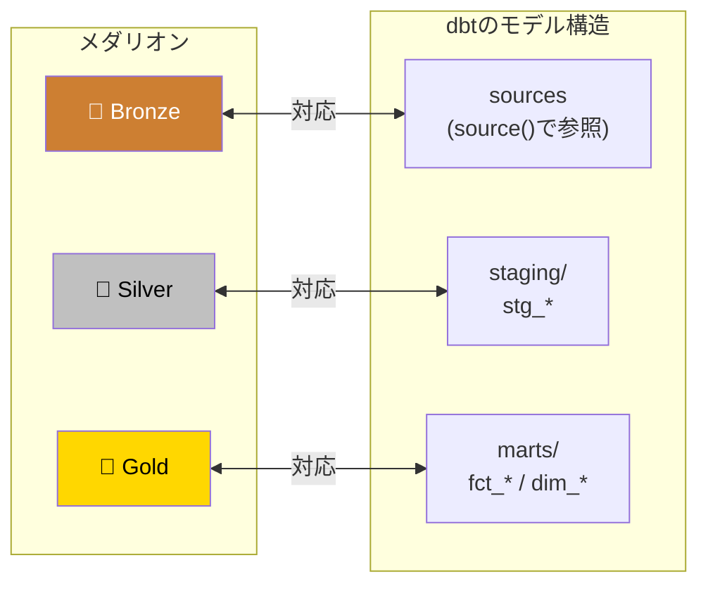

| メダリオン層 | dbtの対応 | 役割 |
|---|---|---|
| **Bronze** | `source()`（dbt管理外） | ELツールがロードした生データ |
| **Silver** | `models/staging/stg_*` | クレンジング・型変換・重複除去 |
| **Gold** | `models/marts/fct_* / dim_*` | 結合・集計・ビジネス指標の算出 |

## テストとドキュメント

### スキーマテスト

dbtでは、YAMLファイルにテストの定義を書くだけで、データ品質のチェックを自動化できます。

```yaml
# models/staging/_stg_models.yml

version: 2

models:
  - name: stg_orders
    description: "注文データ（クレンジング済み）"
    columns:
      - name: order_id
        description: "注文ID（一意）"
        tests:
          - unique        # 重複がないこと
          - not_null      # NULLがないこと

      - name: amount
        description: "注文金額（円）"
        tests:
          - not_null
          # accepted_values: 特定の値のみ許可
          # relationships: 他テーブルの外部キーとの整合性チェック

      - name: status
        description: "注文ステータス"
        tests:
          - accepted_values:
              values: ['pending', 'completed', 'cancelled', 'unknown']
```

dbtに組み込まれているテストは以下の4種類です。

| テスト | 検証内容 |
|---|---|
| **`unique`** | カラムの値が一意であること |
| **`not_null`** | カラムにNULL値がないこと |
| **`accepted_values`** | カラムの値が指定したリストに含まれること |
| **`relationships`** | カラムの値が参照先テーブルに存在すること（外部キー整合性） |

### カスタムテスト

スキーマテストだけでは表現できないビジネスルールは、SQLで直接テストを書くこともできます。テストのSQLは「**不正なレコードを返す**」ように書き、結果が0行なら合格です。

```sql
-- tests/assert_positive_revenue.sql
-- 売上がマイナスの日がないことを検証

SELECT
    order_date,
    total_revenue
FROM {{ ref('fct_daily_sales') }}
WHERE total_revenue < 0
```

### ドキュメント自動生成

dbtは、モデルの定義・テスト・依存関係（DAG）から、**ドキュメントサイトを自動生成** できます。

```bash
# ドキュメントの生成
dbt docs generate

# ローカルでプレビュー
dbt docs serve
```

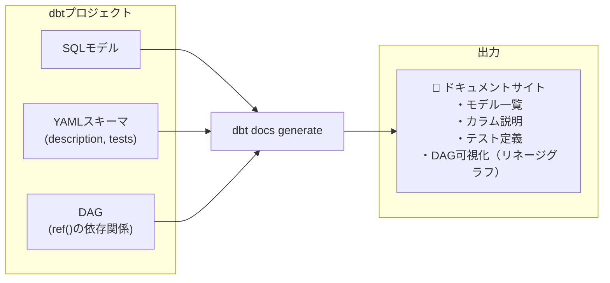

生成されるドキュメントサイトでは、各モデルのカラム説明、テスト定義に加えて、モデル同士のつながり（DAG）を画面上で自由に動かして確認できる**リネージグラフ**も閲覧できます。これにより、「このモデルの上流は何か？」「このソーステーブルを変更したらどのマートに影響するか？」といった影響範囲の把握が容易になります。

## まとめ

dbtは、**ELTの「T」に特化したデータ変換ツール** です。SQLとYAMLだけでデータパイプラインの変換・テスト・ドキュメント化を実現し、ソフトウェアエンジニアリングのベストプラクティス（バージョン管理、テスト、CI/CD）をデータ基盤に持ち込みます。

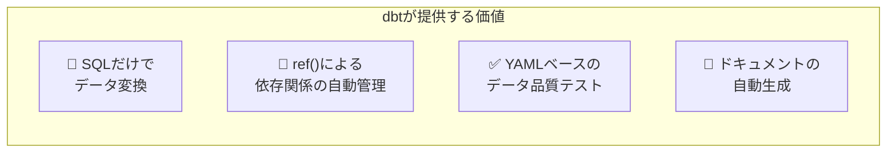

| 要点 | 内容 |
|---|---|
| **dbtの本質** | SQLを組み立ててDWHに投げるだけ。dbt自体はデータの計算をしない |
| **核心の機能** | `ref()` による依存関係の自動解決とDAGの生成 |
| **プロジェクト構造** | `staging/`（Silver層）と `marts/`（Gold層）の2層構成が基本 |
| **実務での構成** | dbt Core + Snowflake / BigQuery が最も一般的 |
| **主要コマンド** | 開発時は `dbt run` + `dbt test`、本番は `dbt build` |
| **テスト** | YAMLで宣言的にデータ品質を検証。`unique`、`not_null` 等 |

:::message
この記事で登場した「メダリオンアーキテクチャ（Bronze / Silver / Gold層）」の概念や、モダンなデータ基盤全体のトレンドについては、以下の記事で詳しく解説しています。
:::

https://zenn.dev/kkoch5t2/articles/41ad155b966681

:::message
**ハンズオン用チュートリアルリポジトリ**
本記事の解説内容を実際に手を動かして試せるサンプルプロジェクト（チュートリアル）をGitHubに公開しています。ローカル環境ですぐに動かせるようになっているので、あわせてご活用ください！
:::

https://github.com/kkoch5t2/dbt_test_local
