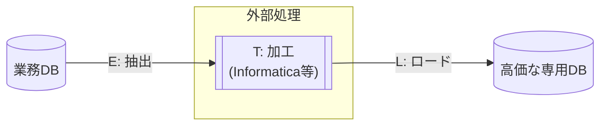
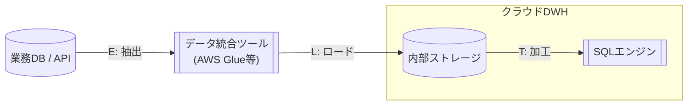
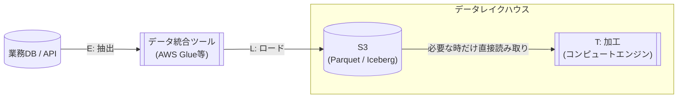

https://zenn.dev/kkoch5t2/articles/38af61316cad6d

以前書いた↑こちらの記事の中で、「現代のデータ基盤ではParquetファイルそのものがデータベースの実体として直接クエリされ続ける」と書きました。

しかし、**なぜそうなったのか？** その背景にあるデータ基盤アーキテクチャの進化を理解しないと、なんとなく理解したまま終わってしまいます。

この記事では、データ基盤がどのように進化してきたかを歴史から整理した上で、最新トレンドである「データレイクハウス」の仕組みを体系的に解説します。

## データ基盤の歴史（3世代）

現在のデータ基盤アーキテクチャは、大きく3つの世代に分けて理解できます。
世代が進むにつれて、**「データをどこに保存するか」と「どうやって加工するか」** の2点が変化してきました。

### 第1世代：オンプレミスDWH（〜2012年頃）



この時代のデータ基盤は **ETL（Extract → Transform → Load）** と呼ばれる方式が主流でした。

データベースのストレージ容量もCPU処理能力も非常に高価だったため、**データをDBに入れる前に、別のサーバーで不要なデータの除去やフォーマット変換などの加工処理（Transform）を行い**、きれいになったデータだけをDBにロード（Load）するという流れです。

- **課題**
  - 専用DBサーバーが高価で、容量を増やすにもハードウェアの追加購入が必要
  - 加工処理を行うETLサーバーの構築・運用に専門的なスキルが必要
  - データ量の増加に対してスケールしにくい

### 第2世代：クラウドDWH（2012年〜2020年頃）



Amazon Redshift（2012年）、Google BigQuery、Snowflake といったクラウドDWH（データウェアハウス）の登場により、データ基盤の構築方法が大きく変わりました。

この世代では **ELT（Extract → Load → Transform）** が主流になります。
クラウドDWHは、自前でサーバーを調達・管理する必要がない**フルマネージドサービス**です。ストレージが安く、処理能力も従量課金で無限にスケールできるため、**「とりあえず生データをそのままDWHにロードして、あとからDWH内でSQLを使って加工する」** という考え方が定着しました。

- **課題**
  - データがDWHの内部ストレージに閉じ込められる（**ベンダーロックイン**）
  - Snowflake内のデータを他のツール（例：Sparkで機械学習）で使いたい場合、一度エクスポートする必要がある
  - 大量のコールドデータ（ほとんどクエリされないデータ）もDWH内に置くとコストがかさむ

### 第3世代：データレイクハウス（2020年頃〜現在）



第2世代の課題を解決するために登場したのが、**Databricks（データブリックス）** によって提唱された概念である **データレイクハウス** です。

https://www.databricks.com/jp/blog/what-is-data-lakehouse

ELTの基本的な流れは変わりませんが、**ロード先（Lの行き先）** が変わりました。
DWHの内部ストレージではなく、**S3などのオブジェクトストレージに、Parquet + Iceberg等のオープンフォーマットで保存する** という構成です。
（※本記事では以降、便宜上オブジェクトストレージの代表例として「S3」と表記しますが、Google CloudのGCSやAzureのADLSでも全く同様に構築可能です）

計算が必要な時だけSnowflakeやDatabricksなどのコンピュートエンジン（サーバレス）を起動して、S3等のデータを直接クエリします。
これが **コンピュートとストレージの分離** と呼ばれる設計思想です。

## データレイクハウスとは何か（最新トレンド）

データレイクハウスは、2020年前後にDatabricks（データブリックス）が提唱した、現時点で最も新しいデータ基盤アーキテクチャです。

一言でいうと、**データレイク（安い・何でも入る・データの品質管理が難しい）とデータウェアハウス（高い・高速・データの整合性や品質が保証される）の良いとこ取り** をしたアーキテクチャです。

S3のような安価なオブジェクトストレージにデータを保存しつつ、DWHのような高速なクエリやトランザクション管理を実現します。

### S3 + Parquet + Icebergで実現する仕組み


データレイクハウスでは、データの実体として**主にParquetなどのオープンフォーマット**がS3に保存されます。
要するに、専用のDBサーバーの中にデータをロードするのではなく、**「S3に置いたファイルの集まりを、そのままデータベースのテーブルとして扱う」** というアプローチです。

しかし、ParquetファイルをS3にただ並べただけでは、**データベースとして致命的な弱点** があります。

* **Parquet単体の弱点**
  * ❌ **UPDATE / DELETE ができない**
    * Parquetはイミュータブル（書き換え不可）なファイル
    * 1行更新するにはファイル全体を書き直す必要がある
  * ❌ **トランザクション（ACID）がない**
    * Aさんが書き込み中にBさんが読むと、中途半端なデータが見える可能性がある
  * ❌ **スキーマ変更（カラム追加など）が困難**
    * 新しく作られるファイルにだけカラムを追加すると、過去のファイルと構造が一致しなくなり、読み込んだ時にエラーになってしまう
    * 回避するには、数TBある過去のすべてのParquetファイルを書き直す（新カラムを追加して保存し直す）という非現実的な作業が必要になる

この弱点を解決するのが **オープンテーブルフォーマット** です。代表的なものに **Apache Iceberg**、Delta Lake、Apache Hudi があります。

#### Apache Icebergとは

Apache Icebergは、Netflixが開発した **オープンテーブルフォーマット** です。

S3上に並んだParquetファイル群に対して、**「どのファイルが最新のテーブルに属するか」を管理するメタデータ層** を追加することで、データベースのような機能を実現します。

```text:❌ Parquetだけの状態（データレイク）
s3://my-bucket/table_name/
├── file_001.parquet
├── file_002.parquet  ← (過去のデータ。内容を更新するために003として作り直されたので、実はもう不要なゴミファイル)
└── file_003.parquet
※ AthenaやSnowflake等のエンジンでSQLを実行した時、この「もう使わないはずの古いファイル」まで集計対象としてスキャンしてしまう
```

```text:✅ Icebergを追加した状態（データレイクハウス）
s3://my-bucket/table_name/
├── 📋 metadata/ (Icebergの目次)
│   ├── snapshot-1.json
│   └── snapshot-2.json  ← 最新の目次「001と003だけ読め」と記載
│
└── 📦 data/ (データの実体)
    ├── file_001.parquet ✅ (目次にあるのでエンジンが読み込む)
    ├── file_002.parquet ❌ (古い不要なファイルとして目次から外されている = エンジンは読み飛ばす)
    └── file_003.parquet ✅ (目次にあるのでエンジンが読み込む)
```

Icebergの核心は **スナップショット** という概念です。テーブルに対する変更が行われるたびに、新しいスナップショット（「今のテーブルはこのファイルの集まりだよ」という目次）が作成されます。

これにより、以下の機能が実現されます。

| 機能 | 仕組み |
|---|---|
| **UPDATE / DELETE** | 元のParquetは書き換えず、変更後の新しいParquetファイルを作成し、スナップショットの目次を切り替える |
| **ACIDトランザクション** | 書き込み中は古いスナップショットが有効。書き込み完了後に目次がすぐに切り替わるため、中途半端なデータが読み込まれることがない |
| **タイムトラベル** | 過去のスナップショットが保持されているため、「昨日時点のデータ」をSQLで簡単にクエリできる |
| **Schema Evolution** | カラムの追加・削除・リネームをメタデータ側で管理。過去のParquetファイルを書き直す必要がない |

#### Snowflakeからの利用

Snowflakeでは、**External Table（外部テーブル）** や **Iceberg Table** を使ってS3上のデータを直接参照できます。
これらは単にS3のファイルを読むだけでなく、**「どのファイルにどんなデータが入っているか」というIcebergの目次（メタデータ）をSnowflakeが読み取ってフル活用してくれます。**
そのため、「探しているデータが入っていないファイルは最初から読み飛ばす」といった効率的なショートカット（クエリの最適化）が可能になり、データがS3にあっても高速に処理できるのです。

### 第2世代（クラウドDWH）との違い

第2世代と第3世代は、どちらもELTベースのアーキテクチャですが、以下の点で異なります。

| 比較項目 | 第2世代（クラウドDWH） | 第3世代（データレイクハウス） |
|---|---|---|
| データの保存先 | DWH内部ストレージ（Snowflake管理のS3等） | ユーザー管理のS3上にオープンフォーマットで保存 |
| データフォーマット | DWH独自の内部形式 | Parquet + Iceberg等のオープンフォーマット |
| 他ツールからのアクセス | DWHを経由する必要がある | S3上のデータをどのエンジンからも直接読める |
| ベンダーロックイン | 高い（データがDWH内に閉じ込められる） | 低い（データは自分のS3にある） |
| コールドデータのコスト | DWH内に置くため割高 | S3の低頻度アクセス層で安く保持できる |

核心は **「データの所有権がDWHベンダーからユーザーの手に戻った」** という点です。
※もちろんAWS等のクラウドインフラストラクチャに依存していることには変わりありませんが、「特定のデータベースソフトの独自フォーマットに縛られず、分析ツールや計算エンジンを自由に選べるようになった」という意味です。

第2世代では、データをSnowflakeにロードした瞬間、そのデータはSnowflakeの独自フォーマットで内部に保存され、他のツールからは簡単にアクセスできませんでした。

データレイクハウスでは、データは自分のS3バケットにParquetというオープンフォーマットで存在するため、Snowflake、Databricks、Athena、Sparkなど **好きなエンジンで自由に読み書きできます**。

### よくある誤解

#### 誤解①：データレイクハウスではDWHにロードしない？

「コンピュートとストレージの分離」と聞くと、SnowflakeのようなDWHはコンピュート専用で、データを保持しないのか？と思った方もいらっしゃるかもしれません。というのも私がそうでした。

ですが、実際のレイクハウス構成では、**データの用途に応じて保存先を使い分ける混合型** が主流です。
これはデータレイクハウスの提唱元であるDatabricksが提唱した **「メダリオンアーキテクチャ（Medallion Architecture）」** というデータ管理のベストプラクティスがベースになっています。

データを「ブロンズ（生データ）」「シルバー（加工済み）」「ゴールド（集計済み）」の3層に分けて管理する考え方で、それぞれの層の要件に応じて以下のようにストレージを使い分けるのが現実的です。

https://www.databricks.com/jp/blog/what-is-medallion-architecture

| メダリオン（層） | データの例 | 保存先 | 理由 |
|---|---|---|---|
| **Bronze / Raw（生データ）** | ログ、APIレスポンス等 | S3上のParquet（External Table） | 量が膨大。安く置いておきたい |
| **Silver / Curated（加工済）** | dbtで整形したファクトテーブル等 | S3上のIceberg Table or DWH内部テーブル | オープン性と速度のバランス |
| **Gold / Mart（集計データ）** | ダッシュボード用の集計テーブル | DWH内部テーブル | 毎日何百回もクエリされるため速度最優先 |

#### 誤解②：毎回S3等の外部ストレージから読み込むと処理が遅くコストが高くなるのでは？

**「DWHにデータを持たず、毎回S3などの外部ストレージから読みに行くなら、逆に遅くて高くつかないの？」** という疑問を持つ方もいらっしゃるのではないでしょうか？

結論から言うと、**トータルで見ると安くなるように設計されています。** その仕組みは3つあります。

##### 1. Parquetの効率的な読み込み

S3に1TBのデータがあっても、毎回1TBを全部読み込むわけではありません。

Parquetの列プルーニングとメタデータ（統計情報）のおかげで、クエリエンジンは **必要なファイルの必要なカラムだけをピンポイントでS3からダウンロード** します。

```text
1TBのデータに対して SELECT AVG(age) FROM users WHERE year = 2024

実際にS3から読むデータ量:
  ✅ 2024年のファイルだけ（Icebergの目次で特定）
  ✅ age列だけ（Parquetの列プルーニング）
  → 実際のダウンロード量はごく一部で済む
```

詳しくは [Parquetの仕組みを理解する](https://zenn.dev/kkoch5t2/articles/38af61316cad6d) を参照してください。

##### 2. コンピュートエンジンのキャッシュ

SnowflakeやDatabricksなどのエンジンは、**一度S3から読んだデータをローカルのSSDにキャッシュ** します。

```text
1回目のクエリ: S3からParquetを取得 → ローカルSSDに保存（少し遅い）
2回目以降:    ローカルSSDから読む（高速）
```

よく使うデータは自動的にキャッシュに乗るため、実質的にはDWH内部にデータがあるのと同じ速度が出ます。不要になったキャッシュは自動的に破棄されます。

##### 3. オブジェクトストレージの階層化

オブジェクトストレージには、アクセス頻度に応じた複数のストレージクラス（階層）が用意されています。以下はS3の例ですが、GCSやAzureでも同様の使い分けが可能です。

| ストレージクラス | 用途 | 月額目安（1TBあたり） |
|---|---|---|
| S3 Standard | 頻繁にアクセスするデータ | 約$23 |
| S3 Infrequent Access | たまにしかアクセスしないデータ | 約$12.5 |
| S3 Glacier | アーカイブ用（ほぼアクセスしない） | 約$4 |

企業が持つデータの大半は「念のため取ってあるログ」のようなコールドデータです。
これを安いストレージクラスに自動的に移行することで、**使わないデータに無駄なお金を払わない** 構成が実現できます。DWH内部に全データを置く構成では、この使い分けができません。

## まとめ

データ基盤のアーキテクチャは、以下のように進化してきました。

```text
第1世代（オンプレミスDWH）
  ETL：高価なDBに入れる前に加工する
    ↓
第2世代（クラウドDWH）
  ELT：安くて強力なクラウドDWHにとりあえず入れてから加工する
    ↓
第3世代（データレイクハウス）← 最新トレンド
  ELT：ロード先をS3上のオープンフォーマットに変え、
       コンピュートとストレージを分離する
```

データレイクハウスの本質は、**「データの所有権をDWHベンダーから自分の手に取り戻し、オープンなフォーマットで保存することで、あらゆるツールから自由にアクセスできるようにした」** という点にあります。

そして、この構成を支えているのが **Parquet等のオープンフォーマット（高効率なデータフォーマット）** と **Iceberg等のオープンテーブルフォーマット（データベース機能の付与）** の2つです。

Parquetの列プルーニングやメタデータの仕組みがあるからこそ、S3上のファイルを直接クエリしても実用的な速度が出る。データレイクハウスとオープンフォーマット・オープンテーブルフォーマットは切っても切れない関係にあると言えます。
