データレイクハウスの文脈で「Apache Iceberg」という名前を耳にする機会が増えてきました。

業務でデータ基盤に携わる中で「これは自分たちの環境でも使えるのでは？」と思い、Icebergの仕組みを一から調べ、実際に手元で動かして検証してみました。

本記事では、その過程で理解した Icebergの内部アーキテクチャ、特に **「メタデータがどのような階層構造で管理されているのか」「更新や削除がどのように実現されるのか」** を体系的にまとめます。

:::message
Icebergの概要やデータレイクハウスとの関係については、以下の記事で解説しています。
:::

https://zenn.dev/kkoch5t2/articles/41ad155b966681

## 🧊 Apache Icebergの概要

Apache Icebergは、Netflixが開発した **オープンテーブルフォーマット** です。

:::message
**💡 補足：オープンテーブルフォーマットとは？**
S3などのデータレイク（単なるファイルの置き場）にテーブルとしての管理機能を追加し、データベースのようにSQLで更新や削除ができるようにする仕組み（仕様）のことです。特定のデータベース製品（SnowflakeやBigQueryなど）の内部にデータを縛り付けず、様々なエンジンから自由にアクセスできる「オープン」な状態を保つのが特徴です。
:::

S3やGCSなどのオブジェクトストレージ上に置かれたParquetファイル群に対して、**メタデータ層** を追加することで、従来のデータベースが持っていた以下の機能を実現します。

| 機能 | 説明 |
|---|---|
| **ACIDトランザクション** | 複数の読み書きが同時に発生しても、データの整合性が保証される |
| **UPDATE / DELETE** | イミュータブル（書き換え不可）なParquetを直接変更せず、メタデータの切り替えで論理的な更新・削除を実現する |
| **タイムトラベル** | 過去の任意の時点のデータをSQLでクエリできる |
| **スキーマ進化** | カラムの追加・削除・リネームを、過去のデータファイルを書き直すことなく実行できる |
| **パーティション進化** | パーティションの粒度（例：月単位→日単位）を、既存データに影響を与えず変更できる |

これらすべてを支えているのが、Iceberg独自の **メタデータ階層構造** です。
※言葉の意味が分からないものも多々あると思いますがこのあと説明していきます。

## 🏗️ Icebergのメタデータ階層構造

Icebergの核心は、**4層のメタデータ** とその先にある **データファイル** で構成される階層構造にあります。クエリエンジンがテーブルを読む際、この階層を上から順にたどることで「どのデータファイルを読むべきか」を高速に特定します。

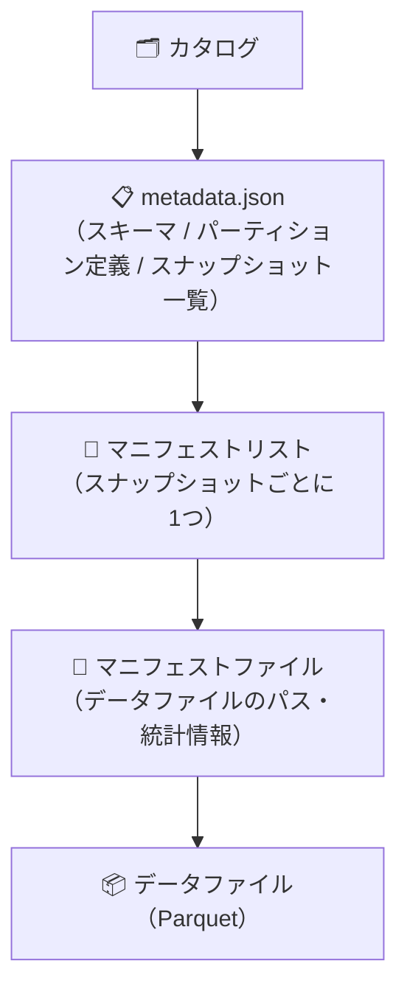

それぞれの層を詳しく見ていきます。

### 🗂️ 第1層：カタログ（Catalog）

カタログは、Icebergテーブルへの **エントリーポイント（入口）** です。
身近な例でいうと **「データベースの電話帳（住所録）」** のような役割を果たします。代表的なものとして **AWS Glue Data Catalog** や **Hive Metastore** があります。

S3などのストレージには無数のファイルが置かれているだけなので、クエリエンジン（AthenaやSparkなど）は「どのファイルが `my_table` というテーブルなのか」を自力で知ることはできません。そのため、まず最初にカタログ（Glueなど）にアクセスして場所を聞き出します。

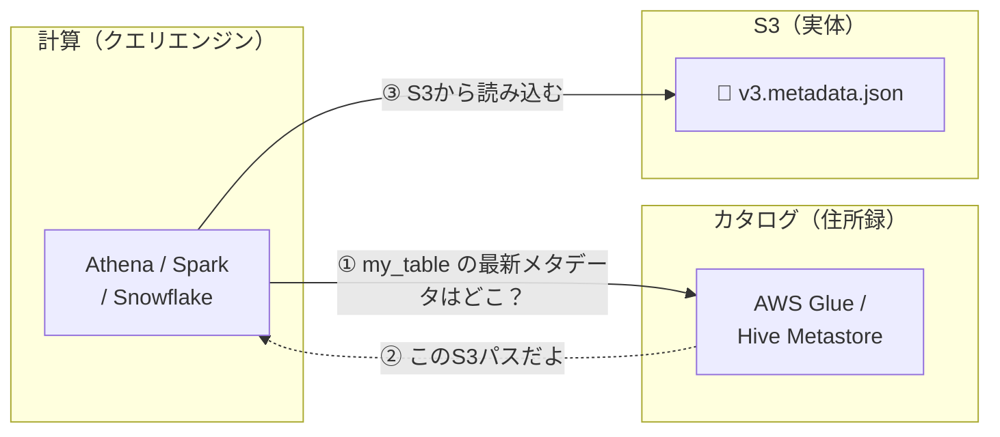

:::message
**💡 補足：特定の環境に依存しないのが「オープンテーブルフォーマット」**
上記の図では、代表例として **Athena**、**Glue**、**S3** を記載していますが、Icebergは特定の環境に縛られず、各層を自由に組み合わせることができます。
- **クエリエンジン**：AthenaやSparkに限らず、**Trino**、**Flink**、**Snowflake**、**BigQuery**、ローカルなら **DuckDB** など、様々なエンジンから同じデータを読み書きできます。
- **カタログ**：住所録の役割を果たせれば何でもよく、ローカル検証時は **REST Catalog**、**JDBC Catalog**、**Hadoop Catalog** 等が柔軟に使われます。
- **ストレージ**：S3に限らず、**GCS** や **Azure Blob Storage**、オンプレミスの **HDFS** や **ローカルフォルダ** でも全く同じように動作します。
:::

:::message
**なぜカタログが必要なのか？**

テーブルが更新されるたびに新しい `metadata.json` ファイルが生成されます（後述）。カタログが「今の最新はどれか」を一元管理することで、複数のエンジンが同時にテーブルを読み書きしても、常に正しいバージョンを参照できます。このポインタの切り替えが **アトミック（不可分）** に行われることで、ACIDトランザクションが実現されています。
:::

### 📋 第2層：テーブルメタデータ（metadata.json）

`metadata.json` は、これらメタデータツリーの **根（ルート）** に位置するファイルです。

:::message
**💡 補足：メタデータツリーとは**
Icebergのメタデータは単一のファイルではなく、テーブル全体を管理する `metadata.json` を頂点（ルート）として、複数のメタデータファイルが枝葉のように連なる階層構造になっています。このツリー構造により、ペタバイト級の巨大なテーブルであっても、一部の必要なファイルのメタデータだけを効率よく読み書きできるように工夫されています。
:::

テーブルのあらゆる定義情報がここに集約されています。

| 保持する情報 | 説明 |
|---|---|
| **テーブルスキーマ** | カラム名、データ型、カラムIDなど |
| **パーティション定義** | どのカラムで、どのようにパーティションを切るか |
| **スナップショット一覧** | テーブルの全バージョン（履歴）のリスト |
| **現在のスナップショットID** | 読み取り時にどのスナップショットを使うか |
| **ソート順** | データファイルの推奨ソート順序 |

:::message
**💡 補足：パーティションとは？**
大量のデータを効率よく検索するために、特定のカラム（日付やカテゴリなど）の値ごとに **物理的なフォルダに分けて保存** する仕組みです。

例えば「日付（`event_date`）」でパーティションを切る設定にした場合、ストレージ（S3など）上では以下のようにデータがフォルダ分割されます。

```text
s3://my-bucket/my-table/data/
  ├── event_date=2023-10-01/  ← 10月1日のデータだけが入る
  │    ├── data-001.parquet
  │    └── data-002.parquet
  ├── event_date=2023-10-02/  ← 10月2日のデータだけが入る
  │    └── data-003.parquet
```

このように物理的に分けておくことで、「10月2日のデータが欲しい」というクエリが来たときに、システムは `event_date=2023-10-02/` フォルダだけを読みに行きます。それ以外のフォルダを完全に無視できるため、検索が劇的に速くなり、無駄な処理コストも削減できます（この仕組みを**パーティションプルーニング**と呼びます）。
:::

テーブルが更新されるたびに、**古い `metadata.json` を書き換えるのではなく、新しい `metadata.json` ファイルが生成** されます。この不変性（イミュータビリティ）がIcebergの信頼性の基盤です。

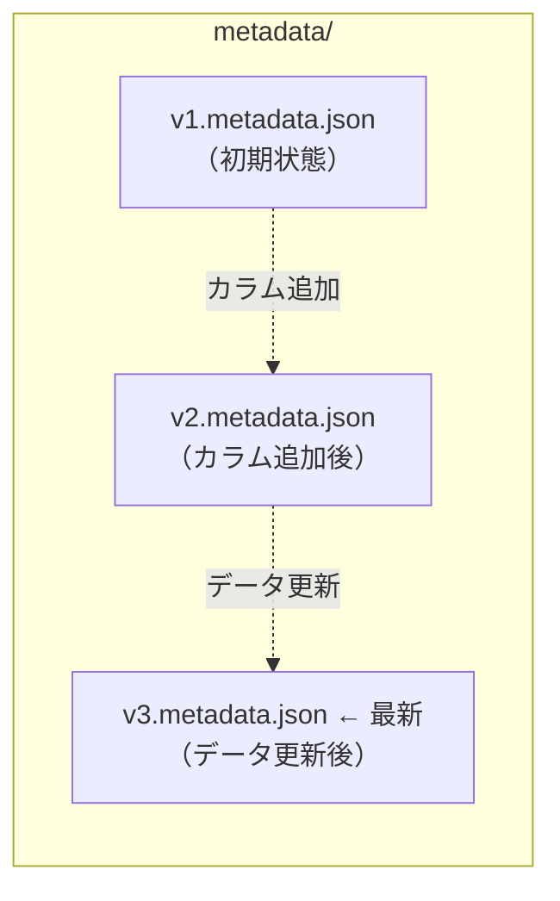

#### 📸 スナップショット（Snapshot）

`metadata.json` の中で特に重要なのが **スナップショット** です。スナップショットは **ある時点のテーブルの完全な状態** を表すもので、テーブルに変更が加えられるたびに新しいスナップショットが `metadata.json` 内に追加されます。

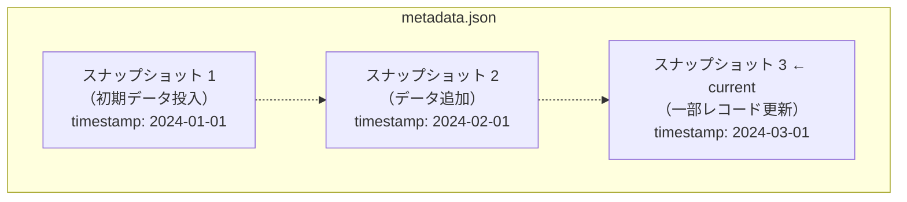

タイムトラベルは、この **過去のスナップショットを指定してクエリする** ことで実現されます。

```sql
-- 「2024年1月1日時点のテーブル」をクエリする
SELECT * FROM my_table
TIMESTAMP AS OF '2024-01-01 00:00:00';
```

各スナップショットは、次の層である **マニフェストリスト** を1つ指しています。

### 📑 第3層：マニフェストリスト（Manifest List）

マニフェストリストは、そのスナップショットに属する **マニフェストファイル（後述）の一覧** を管理するAvro形式のファイルです。

単なるファイル一覧ではなく、各マニフェストファイルについて **「このファイルには 2024年1月 〜 6月 のデータが入っている」といった上限・下限などのサマリー情報** を保持しています。これにより、クエリエンジンはマニフェストファイル自体を開く前に「このマニフェストには今探しているデータは入っていないな」と即座に判断して読み込みをスキップできます。

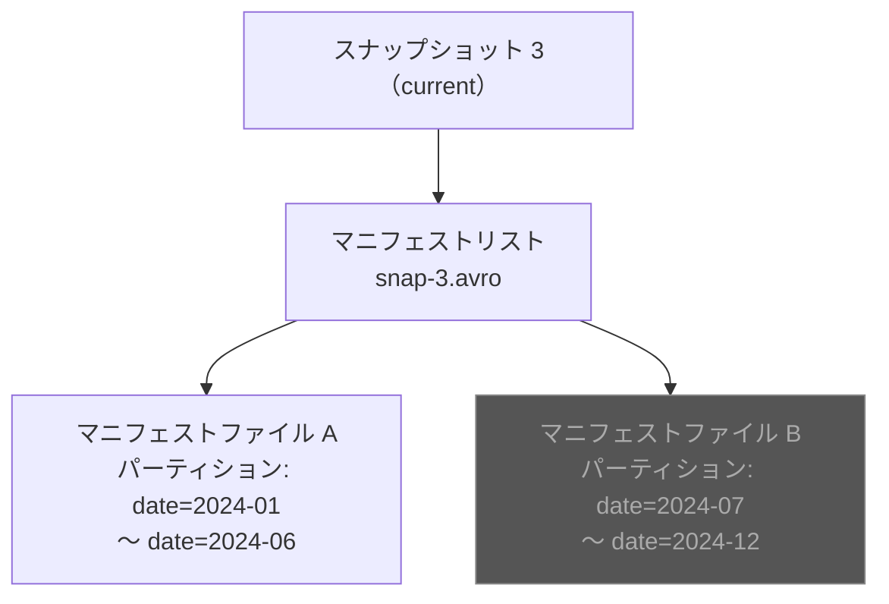

```sql
-- 2024年3月のデータだけを取得するクエリ
SELECT * FROM my_table WHERE date = '2024-03-15';
```

上記のクエリの場合、マニフェストリストの要約情報から **マニフェストファイルBは `date=2024-07〜12` の範囲しか含まない** とわかるため、Bは開かずにスキップされます。これがIcebergにおける **マニフェストレベルのプルーニング** です。

### 📄 第4層：マニフェストファイル（Manifest File）

マニフェストファイルは、メタデータ階層の **最下層** に位置するAvro形式のファイルです。個々のデータファイル（Parquet）の詳細情報を保持しています。

:::message
**💡 補足：Avroでメタデータを管理する理由**

「データ本体はParquetなのに、なぜメタデータはAvroなの？」と疑問に思うかもしれません。結論から言うと、**用途が全く違うため、Icebergが内部で適材適所に使い分けています**（ユーザーがどちらを使うか意識して選ぶ必要はありません）。

- **Parquet（列指向）**：分析クエリで「特定の列だけを高速に読み出す」のに特化。そのため **実データの保存** に使われます。
- **Avro（行指向）**：レコード単位での「高速な書き込み・追記」に特化。Icebergのメタデータは、データが追加されるたびに履歴を行単位で追記していく性質があるため、書き込みが速い **メタデータの保存** に採用されています。

つまり、「読むためのParquet」を、「書くためのAvro」が裏側で管理しているという見事な役割分担になっています。
:::

| 保持する情報 | 用途 |
|---|---|
| **ファイルパス** | `s3://bucket/table/data/file_001.parquet` のような実体の場所 |
| **ファイルフォーマット** | Parquet / ORC / Avro |
| **パーティション値** | そのファイルがどの分割グループ（パーティション）に属しているか（例：`date=2024-01`） |
| **レコード数** | ファイルに含まれる行数 |
| **カラムレベルの統計情報** | 各カラムの最小値・最大値・NULL件数 |

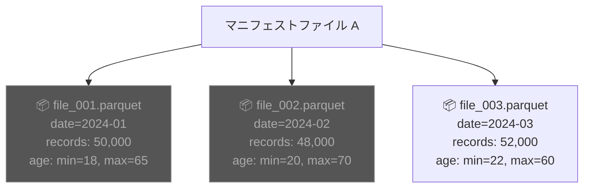

```sql
SELECT * FROM my_table WHERE date = '2024-03-15' AND age > 50;
```

このクエリの場合、マニフェストファイル内の統計情報から `date=2024-01` や `date=2024-02` のファイルは不要と判断され、**file_003.parquet だけが読み込まれます**。さらにParquet自体の列プルーニングや述語プッシュダウンも組み合わさることで、読み取るデータ量が最小限に抑えられます。

https://zenn.dev/kkoch5t2/articles/38af61316cad6d

### 🔍 クエリ実行時の全体フロー

ここまでの内容をまとめると、クエリエンジンがIcebergテーブルを読むときの流れは以下のようになります。

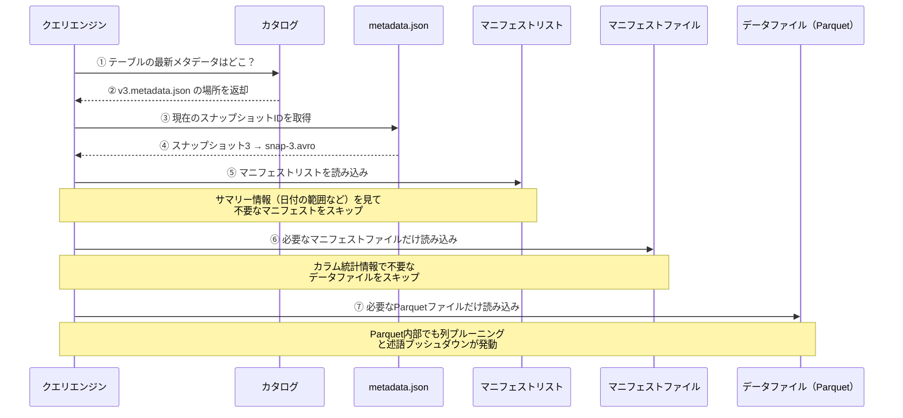

この **多段階のフィルタリング** が、ペタバイト級のデータに対しても高速なクエリを実現するIcebergの仕組みです。

## ✏️ データ更新の仕組み：Copy-on-Write と Merge-on-Read

Icebergが扱うデータファイル（Parquet）は **イミュータブル（書き換え不可）** です。では、UPDATE や DELETE はどのように実現されるのでしょうか？

Icebergでは2つの戦略が用意されています。

### 📝 Copy-on-Write（CoW）

**書き込み時にファイルを丸ごと書き直す** 戦略です。Icebergのデフォルトの動作です。

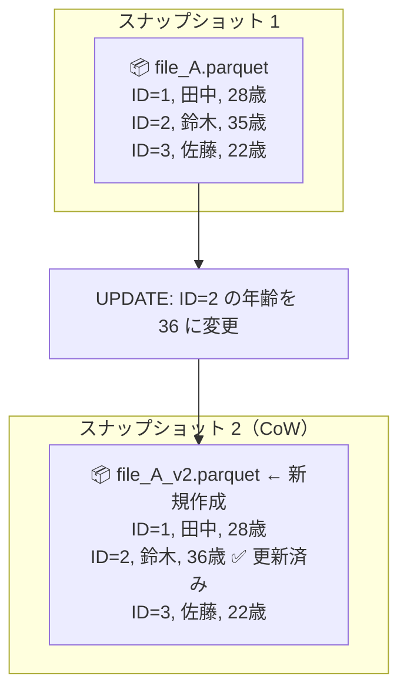

1. 変更対象の行を含むファイル（file_A.parquet）を読み込む
2. 変更を適用した **新しいファイル**（file_A_v2.parquet）を書き出す
3. 新しいスナップショットで、古いファイルを新しいファイルに差し替える

- **メリット**
    - 読み取り時に追加の処理が不要。
    - ファイルの中身は常に「最新の状態」なので、クエリが高速。
- **デメリット**
    - 1行の更新でもファイル全体を書き直すため、書き込みコストが高い。

### 🔀 Merge-on-Read（MoR）

**書き込み時は差分（削除ファイル）だけを記録し、読み取り時にマージする** 戦略です。

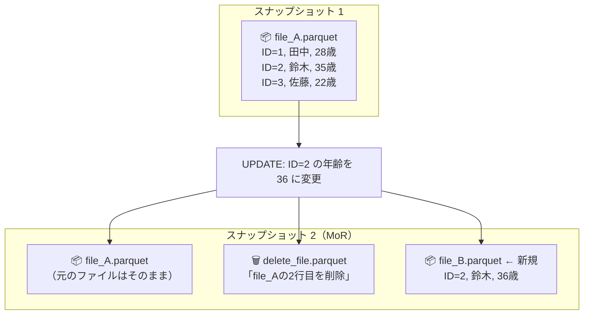

1. 元のファイル（file_A.parquet）はそのまま残す
2. 「file_Aの2行目は削除された」という **削除ファイル（Delete File）** を生成する
3. 更新後のデータを含む **新しいデータファイル**（file_B.parquet）を追加する
4. 読み取り時に、エンジンがデータファイルと削除ファイルを **マージ（合成）** して最新の状態を返す

- **メリット**
    - 書き込みが高速。
    - ファイル全体を書き直す必要がない。
- **デメリット**
    - 読み取り時にマージ処理が必要なため、削除ファイルが蓄積するとクエリ性能が劣化する。
    - 定期的な **コンパクション**（削除ファイルをデータファイルに統合する作業）が必要。

### 🆚 CoW と MoR の使い分け

| 比較項目 | Copy-on-Write（CoW） | Merge-on-Read（MoR） |
|---|---|---|
| **書き込みコスト** | ❌ 高い（ファイル全体を書き直し） | ✅ 低い（差分のみ記録） |
| **読み取りコスト** | ✅ 低い（マージ不要） | ❌ 高くなりうる（マージ処理が必要） |
| **向いているワークロード** | 読み取りが多い分析系 | 書き込みが頻繁なCDC・ストリーミング系 |
| **メンテナンス** | 不要 | コンパクションが必要 |

:::message
**CDC（Change Data Capture）とは？**
業務システムのデータベースで発生した変更（INSERT / UPDATE / DELETE）をリアルタイムに検知して、別のシステム（DWHなど）に反映する仕組みです。変更が高頻度に発生するため、毎回ファイルを丸ごと書き直すCoWよりも、差分だけを記録するMoRの方が効率的です。
:::

## 🔄 スキーマ進化とパーティション進化

Icebergのメタデータ駆動のアーキテクチャが真価を発揮するのが、**スキーマ進化** と **パーティション進化** です。

:::message
**💡 補足：そもそも「スキーマ」と「パーティション」とは？**
- **スキーマ (Schema)**：テーブルの「設計図」のことです。テーブルにどんなカラム（列）が存在し、それぞれがどんなデータ型なのかを定義したものです（例：「IDは数字、名前は文字列」など）。
- **パーティション (Partition)**：膨大なデータを効率よく検索するために、特定のルールでデータを「物理的なフォルダに分割して保存する仕組み」のことです（例：売上データを「2024年1月」「2月」と月ごとに分けて保存するなど）。
:::

### 📐 スキーマ進化（Schema Evolution）

従来のデータレイク（Parquetをただ並べた構成）では、カラムを追加したい場合、**過去のすべてのParquetファイルを書き直す** 必要がありました。

Icebergでは、スキーマの変更は **metadata.json のスキーマ定義を更新するだけ** で完了します。過去のデータファイルには一切手を加えません。

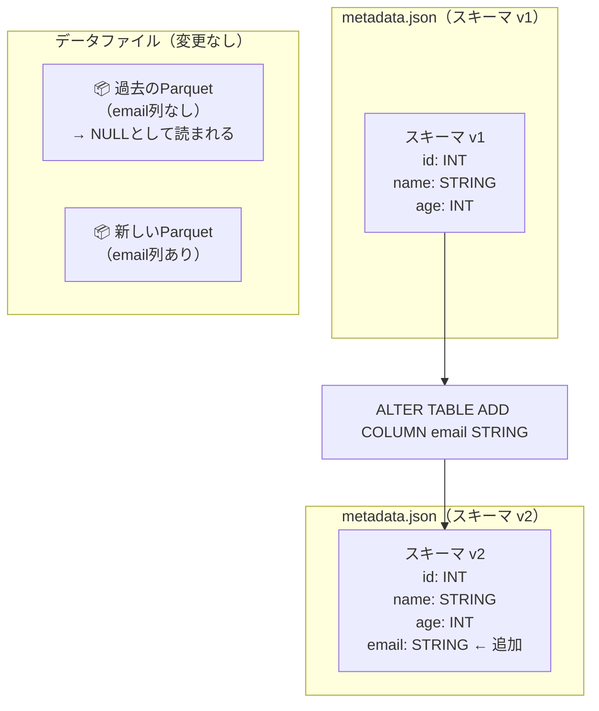

過去のデータファイルにはemail列が存在しませんが、クエリ時にIcebergが自動的にNULLを補完して返します。**数億行のデータを書き直す必要がなく、メタデータの更新だけで即座に完了する** のがIcebergの強みです。

### 📊 パーティション進化（Partition Evolution）

データ量の増加に伴い、パーティションの粒度を変更したくなることがあります。例えば、「月単位のパーティション」を「日単位」に変更するケースです。

従来のHiveスタイルでは必須だった **全データの再配置** が不要になり、Icebergではメタデータの定義を変更するだけで、**過去のデータはそのまま、新しいデータから新しいパーティション粒度を適用** できます。

:::message
**💡 補足：従来のHive（ハイブ）スタイルとは？**
システムがデータを検索する際、実際の「フォルダ名（例：month=2023-11）」だけを頼りにして探す古い仕組みのことです。
この方式では **「1つのテーブルにつき、フォルダの分け方のルールは1つだけ」** という厳しい制約があります。そのため、「最初は月ごとに分けていたけど、今日からは日ごとに分けたい」とルールを変更した場合、システムは新しいルール（日ごと）でしかデータを探せなくなり、**過去の「月ごとのフォルダ」を正しく読み取れなくなってしまいます**。
結果として、システムがエラーを起こさないように、過去の膨大なデータもすべて新しいルール（日ごと）のフォルダにわざわざ移動・書き直す（再配置する）必要がありました。
:::

具体的には、ストレージ上で以下のようなフォルダ構成になります。

```text
s3://my-bucket/my-table/data/
  ├── month=2023-11/  ← 過去のデータはそのまま（月単位）
  │    └── data-001.parquet
  ├── month=2023-12/
  │    └── data-002.parquet
  │
  ├── date=2024-01-01/ ← 変更後のデータは新ルール（日単位）
  │    └── data-003.parquet
  ├── date=2024-01-02/
  │    └── data-004.parquet
```

このように、過去のデータをわざわざ新しいルール（日単位）に合わせて書き直す必要がありません。Icebergはメタデータ側で「いつからパーティションの切り方が変わったか」をすべて記憶しているため、クエリ実行時には**新旧のフォルダルールが混在していても全く問題なく透過的に検索**してくれます。

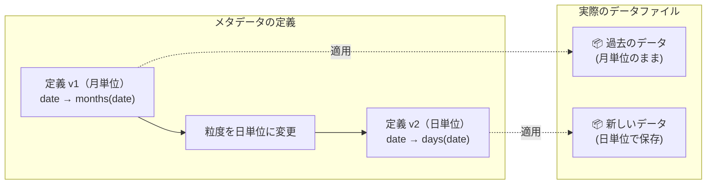

Icebergのクエリエンジンは、マニフェストファイル内のパーティション情報を参照するため、**新旧のパーティション粒度が混在していても正しくクエリを処理** できます。

## 🧹 テーブルメンテナンス

Icebergはスナップショットや削除ファイルが蓄積していく性質上、定期的なメンテナンスが重要です。

| メンテナンス操作 | 目的 |
|---|---|
| **スナップショットの期限切れ処理** | 古いスナップショットとそれだけが参照するデータファイルを削除し、ストレージを解放する |
| **孤立ファイルの削除** | どのスナップショットからも参照されていないデータファイルを削除する |
| **コンパクション** | 小さなファイルや削除ファイルを統合し、読み取り性能を維持する |

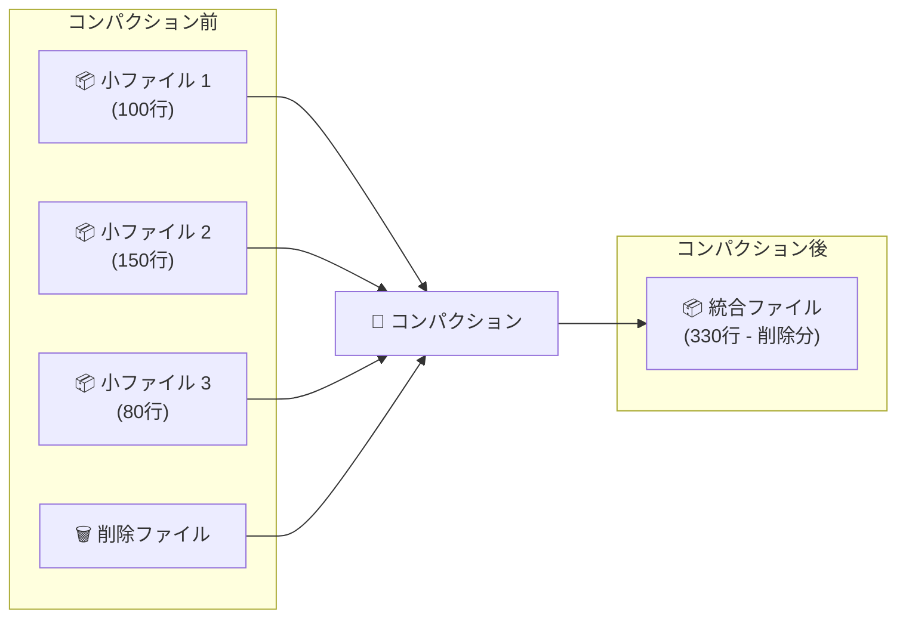

:::message
コンパクションを怠ると、小さなファイルが大量に蓄積してクエリ性能が劣化します（スモールファイル問題）。特にMoR戦略を採用している場合は、削除ファイルの統合も含めて定期的なコンパクションが不可欠です。
:::

## 🎯 まとめ

Apache Icebergの内部アーキテクチャは、以下のメタデータ階層で構成されています。

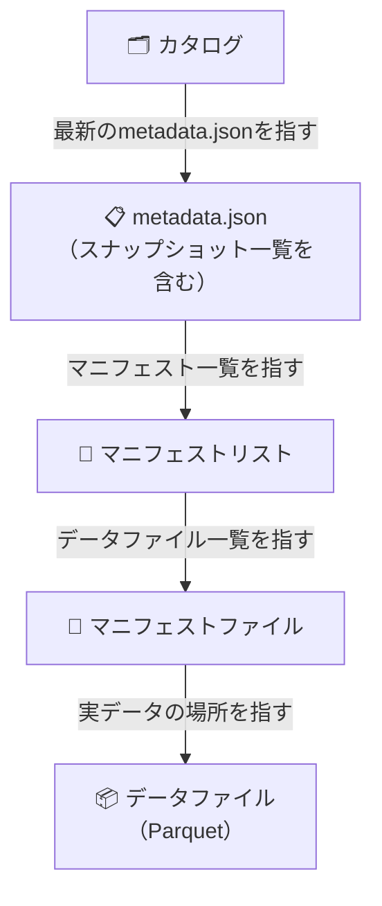

この階層構造によって、以下が実現されています。

1. **ACIDトランザクション：** カタログのポインタをアトミックに切り替えることで、書き込み中のデータが読まれることを防ぐ
2. **タイムトラベル：** 過去のスナップショットを保持し続けることで、任意の時点のデータをクエリ可能にする
3. **高速なクエリ：** マニフェストリスト → マニフェストファイル → データファイルの各段階で不要なデータをプルーニング（読み飛ばし）する
4. **スキーマ進化・パーティション進化：** メタデータ層だけを変更し、データファイルを書き直さない

:::message
**ハンズオンでIcebergを体験したい方へ**
Jupyter Notebookを使って、手元のPCで実際にIcebergの挙動（更新・削除・タイムトラベル・スキーマ進化・パーティション進化・WAPパターンなど）を試せるチュートリアル環境を公開しています。セットアップから実行まで数分で完了しますので、興味がある方はぜひ触ってみてください。
:::

https://github.com/kkoch5t2/iceberg-playground

