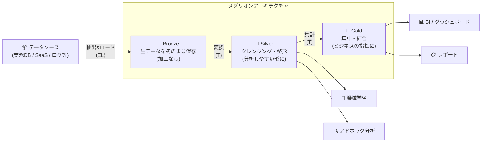
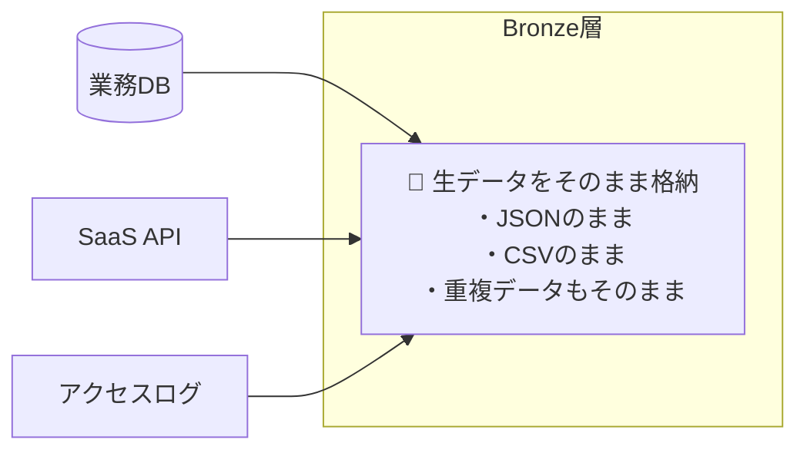
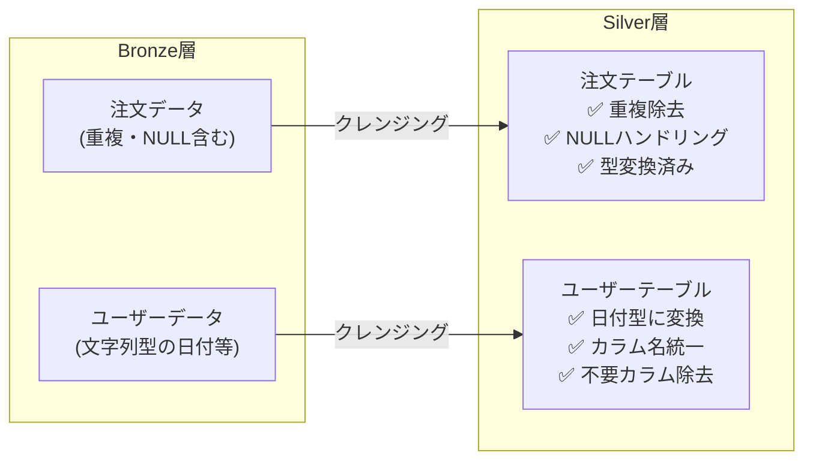
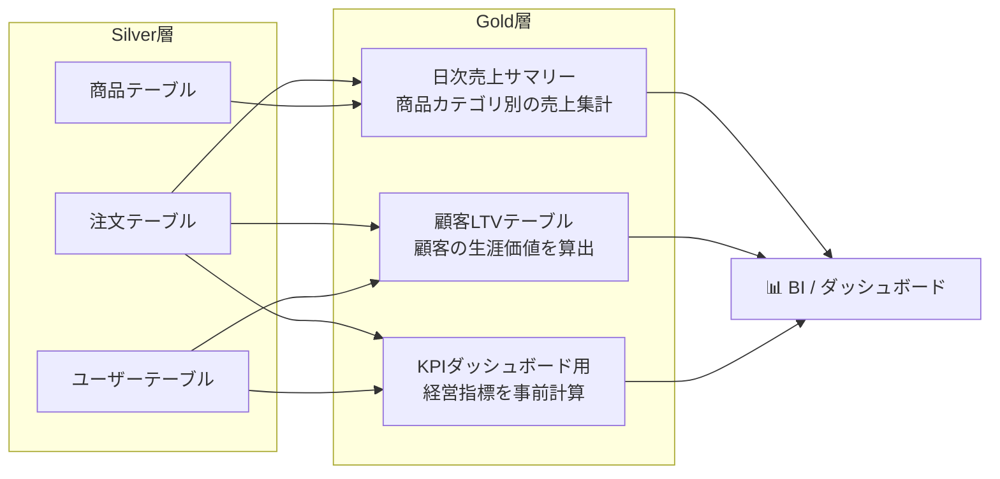
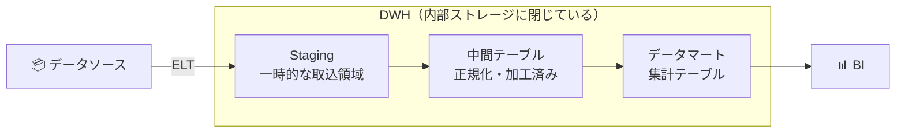
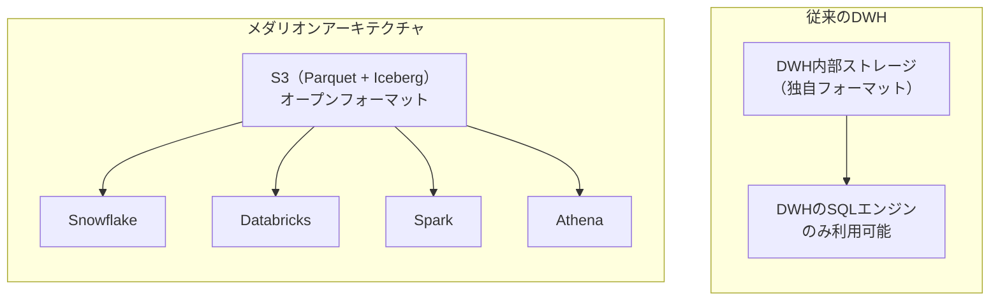
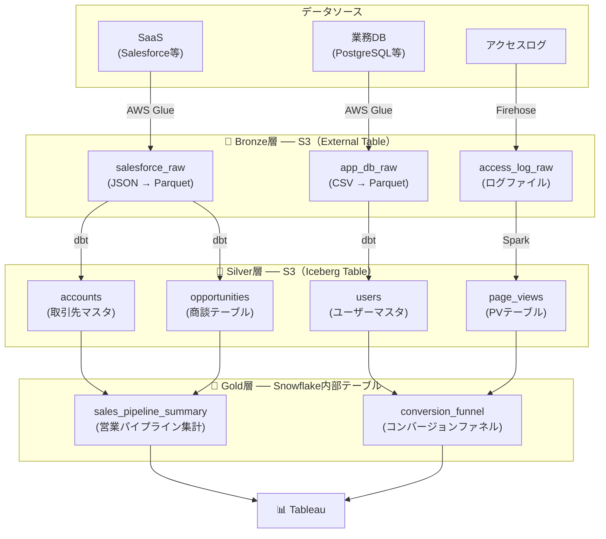
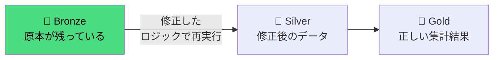
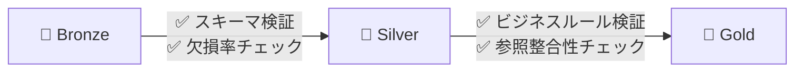
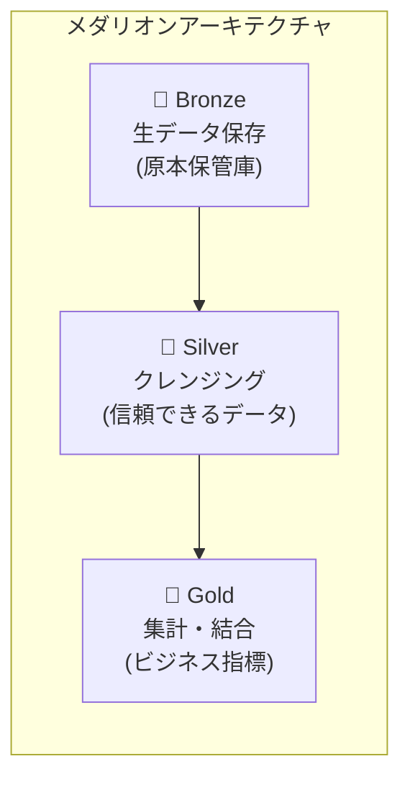

この記事では、データレイクハウスにおけるデータ管理のベストプラクティスとして知られる **メダリオンアーキテクチャ（Medallion Architecture）** について、概要から実務での活用方法まで体系的に解説します。

:::message
データレイクハウスそのものの仕組み（データ基盤の歴史的な進化の過程も含めて）については、以下の記事で詳しく解説しています。
:::

https://zenn.dev/kkoch5t2/articles/41ad155b966681

## メダリオンアーキテクチャとは

メダリオンアーキテクチャとは、データレイクハウス上のデータを **Bronze（ブロンズ）・Silver（シルバー）・Gold（ゴールド）** の3層に分けて段階的に品質を高めていく、データ管理の設計パターンです。

:::message
**用語の背景について**
「メダリオンアーキテクチャ」という言葉自体は、データレイクハウスの提唱者であるDatabricksが、自社のアーキテクチャのベストプラクティスを説明するために作った造語です。そのため、文脈としてはデータレイクハウスとセットで語られることが非常に多いです。

ただし、「生データをそのまま置く」「きれいに加工する」「分析用に集計する」という3層構造の概念自体は、昔から従来のデータウェアハウス（DWH）で当たり前に行われてきた設計です。
現在ではこの「Bronze/Silver/Gold」というネーミングの分かりやすさから、Microsoft Fabricなどのデータレイクハウス以外のデータ基盤でも広く使われる一般用語になりつつあります。
:::
https://www.databricks.com/jp/blog/what-is-medallion-architecture



名前の由来は、オリンピックのメダルです。データが「銅 → 銀 → 金」と段階的に磨き上げられていくイメージから、この名前がつけられました。

## 各層の役割と具体例

### 🥉 Bronze層（Raw / 生データ層）

**役割：ソースシステムからのデータを、加工せずにそのまま保存する**



Bronze層は「**データの原本保管庫**」です。ソースシステムから取得したデータを、一切の加工を加えずにそのまま保存します。

| 項目 | 内容 |
|---|---|
| **保存するデータ** | API のレスポンスJSON、DBからの抽出CSV、ログファイル等 |
| **加工** | しない（生のまま保存） |
| **目的** | 「元データにいつでも戻れる」状態を確保する |
| **保存先の例** | S3上のParquetファイル（External Table） |

:::message
なぜ生データを残すのか？

Silver層以降の加工ロジックにバグがあった場合、Bronze層の生データがあれば**やり直し（リカバリー）が可能**です。もし生データを残さずに加工済みのデータだけを持っていると、修正のしようがなくなってしまいます。
:::

### 🥈 Silver層（Curated / クレンジング済みデータ層）

**役割：Bronze層のデータをクレンジング・整形し、複数ソースのデータを統合（Enterprise View）して分析しやすい構造にする**



Silver層は「**信頼できるデータの集まり**」です。Bronze層の生データに対してクレンジング（浄化）を行い、分析やダウンストリーム処理に使える品質まで引き上げます。
また、別々のシステム（SaaSや自社DBなど）から散発的に入ってくるデータを、単一のマスターデータやトランザクションテーブルに名寄せ・統合（Enterprise Viewの作成）するのもこの層の重要な役割です。

| 項目 | 内容 |
|---|---|
| **行う加工** | 複数ソースからのデータ統合（名寄せ）、重複除去、NULL値の処理、データ型の変換、カラム名の統一等 |
| **テーブル設計** | ソースシステムの構造に近い正規化されたテーブル群 |
| **利用者** | データエンジニア、データサイエンティスト |
| **保存先の例** | S3上のIceberg Table、または DWH内部テーブル |

### 🥇 Gold層（Mart / ビジネス指標層）

**役割：Silver層のデータを集計・結合し、ビジネスユーザーがそのまま使える形にする**



Gold層は「**ビジネスユーザー向けの完成品**」です。Silver層の整形済みデータを集計・結合して、ダッシュボードやレポートから直接参照できるテーブルを作ります。

| 項目 | 内容 |
|---|---|
| **行う加工** | テーブルの結合（JOIN）、集計（GROUP BY）、KPIの事前計算等 |
| **テーブル設計** | ビジネス用途に特化したスタースキーマ等の非正規化テーブル |
| **利用者** | ビジネスアナリスト、経営層、BIツール |
| **保存先の例** | DWH内部テーブル（クエリ頻度が高いため速度最優先） |

## 3層を俯瞰する：データの流れ全体像

各層を通して、データがどのように変化していくかを具体例で見てみましょう。

### 🥉 Bronze（生データ）

ECサイトからの注文APIレスポンスを、加工せずにJSONのまま保存します。

```json
{
  "order_id": "ORD-001",
  "user_id": "U-123",
  "amount": "1500",
  "created_at": "2024-03-15T10:30:00Z",
  "status": null
}
```

⬇️ **加工（JSONからテーブル形式に展開・型変換・NULL補完・重複排除）**

### 🥈 Silver（クレンジング済み）

分析しやすいように、表形式に変換し、データ型を揃えてNULLを処理します。

**orders テーブル**
| order_id | user_id | amount | created_at | status |
|---|---|---|---|---|
| ORD-001 | U-123 | 1500 | 2024-03-15 | unknown |

⬇️ **集計（日付でGROUP BY・注文件数や合計金額などを計算）**

### 🥇 Gold（集計済み）

ダッシュボードから直接読み込めるように、ビジネス指標として集計します。

**daily_sales テーブル**
| date | total_orders | total_revenue | avg_order_value |
|---|---|---|---|
| 2024-03-15 | 342 | ¥5,130,000 | ¥15,000 |

## メダリオンアーキテクチャ vs 従来のDWH：何が違うのか？

「データを段階的に加工していく」という考え方自体は、従来のDWH（データウェアハウス）にもありました。では、メダリオンアーキテクチャは何が新しいのでしょうか？

### 従来のDWHのデータ管理

従来のDWHでも、データをステージング → 中間テーブル → マートと段階的に加工していました。



### メダリオンアーキテクチャとの比較

| 比較項目 | 従来のDWH | メダリオンアーキテクチャ |
|---|---|---|
| **データの保存先** | すべてDWH内部ストレージ | 層ごとに最適なストレージを使い分ける |
| **生データの保持** | ステージングは一時領域で、ロード後に消される場合がある | Bronze層で原本を永続的に保存 |
| **コンピュートの柔軟性** | DWH固有のSQLエンジンでのみ処理 | SQL・Spark・Pythonなど複数エンジンで処理可能 |
| **ベンダーロックイン** | 高い（データがDWH内に閉じる） | 低い（オープンフォーマットでS3に保存） |
| **コールドデータのコスト** | DWH内に置くため割高 | S3の低頻度アクセス層で安価に保持 |
| **スケーラビリティ** | DWHの容量に依存 | S3で実質無制限にスケール |

最大の違いは、基盤となる **「データレイクハウスによるストレージの柔軟性」** です。

従来のDWHでは、すべてのデータがDWHの内部ストレージに保存されていました。これは、DWHの独自フォーマットでデータが閉じ込められるということでもあります。

データレイクハウスという柔軟な基盤の上でメダリオンアーキテクチャを構築する場合、データはS3などのオブジェクトストレージにParquet + Icebergなどのオープンフォーマットで保存されるため、SnowflakeでもDatabricksでもSparkでも、好きなツールで自由にアクセスできます。



:::message
もちろん、メダリオンアーキテクチャのGold層（クエリ頻度が高い）では、速度を優先してDWH内部テーブルにデータを置くことも一般的です。すべてをS3に置くのではなく、**層ごとの要件に応じてストレージを使い分ける** のがメダリオンアーキテクチャの考え方です。
:::

## 実務ではどう使われるのか？

ここからは、メダリオンアーキテクチャが実際の現場でどのように活用されるかを、具体的なシナリオで解説します。

### 実務での構成例

以下は、AWSベースのデータ基盤でメダリオンアーキテクチャを適用した場合の典型的な構成です。



| 層 | 保存先 | テーブル形式 | 加工ツール | コスト感 |
|---|---|---|---|---|
| **Bronze** | S3 | External Table（Parquet） | AWS Glue / Firehose | 💰（安い） |
| **Silver** | S3 | Iceberg Table | dbt（Athena等で実行）<br>Spark（AWS Glue等で実行） | 💰💰 |
| **Gold** | Snowflake内部 | 内部テーブル | dbt（Snowflake上で実行） | 💰💰💰（速度最優先） |

:::message
**補足：Silver層での加工ツールとその実行場所について**
図表にあるように、dbtとSparkは役割が異なります。
- **dbt**: 計算は行わず、SQLを組み立てて投げるツールです。実際の計算は **Amazon Athena** や **Snowflake** 側に担わせます。
- **Spark**: 分散処理フレームワークであり、AWS環境であればフルマネージドな **AWS Glue** や Amazon EMR の上で実行されます。構造化データはdbt（SQL）、大容量・非構造化ログデータはSpark、といったように使い分けるのが一般的です。
:::

### よくある使い分けパターン

#### パターン①：全層S3に置く（コスト重視）

データ量が膨大で、コストを最優先にしたい場合。Gold層もS3上のIceberg Tableにして、Athena等の安価なサーバレスエンジンでクエリする。

**向いているケース：** ログ分析基盤、データ量は多いがクエリ頻度は低い

#### パターン②：Gold層だけDWHに入れる（バランス型）

Bronze・SilverはS3で安く保持し、毎日何百回もクエリされるGold層だけSnowflake等のDWH内部に置く。上記の構成図はこのパターンです。

**向いているケース：** 一般的な企業のデータ基盤。最も採用実績が多い

#### パターン③：Silver・Gold両方DWHに入れる（速度重視）

データサイエンティストがSilver層にも頻繁にアドホッククエリを投げるような環境では、Silver層もDWH内部に置くことで分析の待ち時間を減らす。

**向いているケース：** 分析チームが大きく、探索的な分析が頻繁に行われる組織

## メダリオンアーキテクチャを導入するメリット

### 1. 障害からのリカバリーが容易

Bronze層に原本データが残っているため、Silver・Gold層の加工ロジックにバグが見つかっても**やり直しが可能**です。



### 2. データ品質の段階的な保証

各層で品質チェックを行うことで、問題のあるデータが下流に流れるのを早期に防げます。



### 3. 責任範囲の明確化

層ごとに担当チームを分けることで、責任の所在が明確になります。

| 層 | 主な担当者 |
|---|---|
| **Bronze** | データエンジニア（データ取り込みパイプラインの構築・運用） |
| **Silver** | データエンジニア / アナリティクスエンジニア（dbt等でのクレンジング） |
| **Gold** | アナリティクスエンジニア / データアナリスト（ビジネス指標の定義・集計） |

:::message
**補足：アナリティクスエンジニアとは？**
近年、データエンジニアとデータアナリストの中間に位置する職種として注目されています。
従来のデータアナリストが担当していたSQLでのデータ加工・集計業務に対して、ソフトウェアエンジニアリングのベストプラクティス（Gitによるバージョン管理、CI/CD、テストコードの記述など）を持ち込み、主にSilver層からGold層のデータモデリング（dbtなどの活用）とデータ品質の保証を専門に行う役割です。
:::

## まとめ

メダリオンアーキテクチャは、データレイクハウス上でデータを **Bronze → Silver → Gold** の3層に分けて段階的に品質を高めていく、データ管理の設計パターンです。



従来のDWHにおける「ステージング → 中間テーブル → マート」という考え方と似ていますが、**データレイクハウス上でメダリオンアーキテクチャを採用する最大のメリット**は、オープンフォーマットのオブジェクトストレージを活用し、層ごとに最適なストレージとエンジンを選択できる柔軟性にあります。

すべてのデータをDWH内部に閉じ込めるのではなく、Bronze層はS3で安く、Gold層はDWHで速く、というように**コストと速度のバランスを最適化**できる点が、旧来のDWHアーキテクチャとの決定的な違いです。
