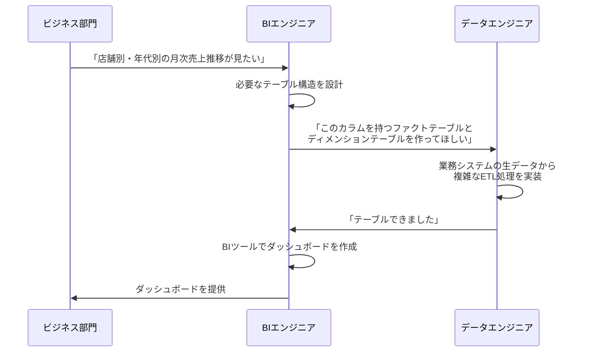
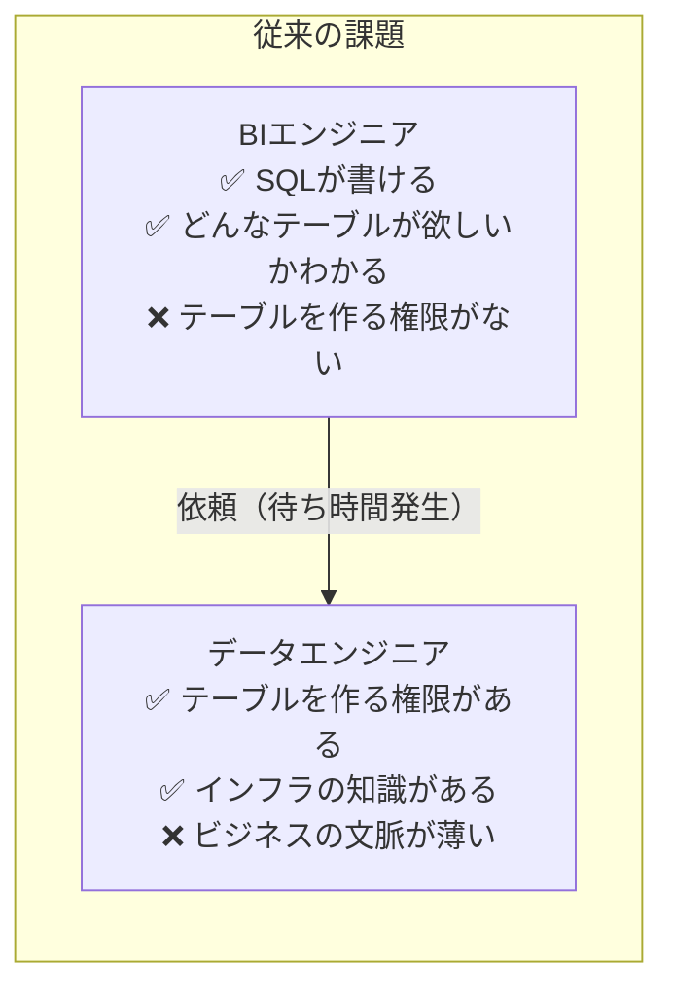
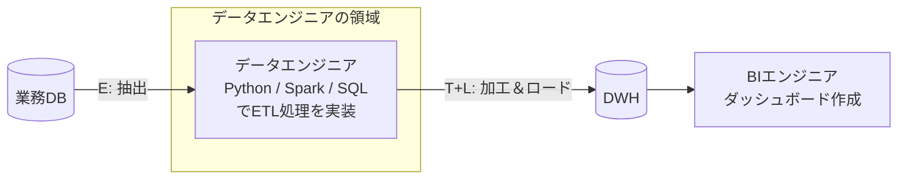
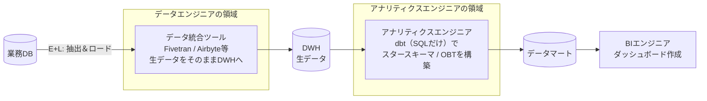
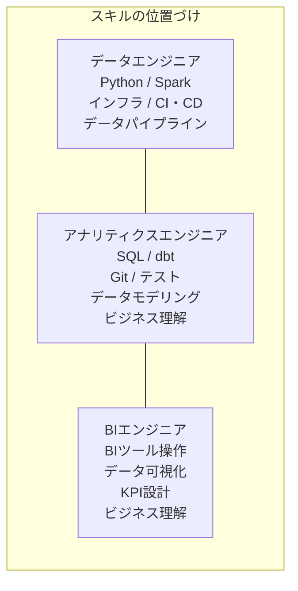

データ基盤に関わる職種として、近年急速に認知が広がっている **「アナリティクスエンジニア（Analytics Engineer）」** という役割があります。

この記事では、従来の「データエンジニア」と「BIエンジニア（データアナリスト）」の分業体制が **なぜうまくいかなくなったのか** を掘り下げた上で、その課題を解決するために生まれた「アナリティクスエンジニア」という職種の背景と、現代のデータ開発プロセスの変化について解説します。

:::message
本記事は、以下の記事の続編（組織・プロセス編）として書いています。スキーマの基本的な概念（スタースキーマ、スノーフレークスキーマ、OBTなど）については前編をご覧ください。
:::

https://zenn.dev/kkoch5t2/articles/d99ac5703d024a

## 従来の分業体制：データエンジニアとBIエンジニア

データ基盤に関わる職種は、大きく2つに分かれていました。それぞれ求められるスキルセットが異なるため、組織が大きくなるほど明確に分業されるのが一般的です。

| 職種 | 主な役割 | 主なスキル |
|---|---|---|
| **データエンジニア（DE）** | データ基盤の構築・運用。データが正確に、安全に、毎日止まらずに流れる仕組みを作る | Python / Scala、インフラ構築（AWS / GCP）、Airflow等のワークフロー管理、セキュリティ |
| **BIエンジニア / データアナリスト** | ビジネス課題の解決。ダッシュボードの作成、KPIの定義と可視化 | ビジネス理解、Tableau / Power BI等のBIツール操作、データ可視化、SQL |

### 従来の開発プロセス

実務では、以下のようなプロセスでデータ基盤が開発・運用されていました。



1. **ビジネス部門からの要求：** 「この切り口でデータを見たい」という依頼がBIエンジニアに届く
2. **BIエンジニアの設計：** 必要なファクトテーブル・ディメンションテーブルの構造を定義し、データエンジニアに依頼する
3. **データエンジニアの実装：** 業務システムの生データから複雑なSQLやPythonを書いて、依頼された通りのスタースキーマ（データマート）を構築する
4. **BIエンジニアの可視化：** 出来上がったテーブルをBIツールに読み込ませてダッシュボードを作成する

このプロセス自体は論理的で正しく、**今でも多くの企業で採用されている王道の手法**です。

しかし、この分業体制には現場で大きな問題が発生していました。

## 従来の分業体制が抱えていたボトルネック

### BI側の不満：「待ち時間」が長すぎる

ビジネス側からの要求は日々変化します。「ダッシュボードに『性別』の切り口も追加してほしい」といった、一見シンプルな変更依頼であっても、BIエンジニアが自分で対応することはできません。

データエンジニアにテーブルの変更を依頼し、エンジニアのスプリント（開発サイクル）に組み込まれるのを待つ必要があります。

```text
BIエンジニアの体験:

月曜日: 「性別カラムを追加してほしい」と依頼
  ↓
データエンジニア: 「今のスプリントは別の案件で埋まっているので、対応は2週間後になります」
  ↓
2週間後: ようやくテーブルが更新される
  ↓
BIエンジニア: ダッシュボードに反映
  ↓
ビジネス部門: 「もう要件変わったんだけど……」
```

**カラム1つの追加に2週間かかる** という状況が繰り返されると、ビジネス側の意思決定のスピードに基盤が追いつかなくなります。

### DE側の不満：「SQLの下請け」に疲弊する

一方、データエンジニアにとっても、この体制は辛いものでした。

データエンジニアの本来の専門領域は、インフラの設計・最適化、データパイプラインの信頼性向上、セキュリティ対策など、高度な技術的課題の解決です。

しかし実態としては、日々の業務の大半が **BIチームからの「あのカラム追加して」「このテーブルを結合して」という、SQLの加工・整形作業** に追われることになりがちです。

```text
データエンジニアの理想と現実:

理想: インフラの最適化、パイプラインの自動化、データ品質の監視
現実: 「このディメンションにカラム追加して」「あのファクトのJOIN条件直して」の対応に追われる毎日
```

### ボトルネックの本質

この問題の根本原因は、**「データを加工するスキル（SQL）」と「テーブルの設計・実装権限」が分離している**ことにありました。

BIエンジニアはSQLを書けるし、どんなテーブルが欲しいかも自分が一番よくわかっている。にもかかわらず、テーブルを作る権限とインフラの知識がないため、毎回データエンジニアに依頼するしかない。データエンジニアはビジネスの文脈を十分に理解していないため、依頼内容の認識齟齬が発生しやすい。



この構造的なボトルネックを解消するために、新しい職種が生まれました。

## 正規化（スノーフレークスキーマ）がETLにもたらす辛み

分業体制の問題に加えて、スキーマの設計方針自体がデータエンジニアの負担を増やしているケースもありました。ここでは、スノーフレークスキーマ（正規化された構造）がETLパイプラインに与える影響を具体的に見てみます。

### 外部キー制約と「書き込み順序」の問題

スノーフレークスキーマでは、各テーブルがID（外部キー）で細かく紐づいています。新しいデータをテーブルに書き込む際、この外部キー制約が **「書き込む順番」を厳密に制御しなければならない** という問題を引き起こします。

たとえば、新しい顧客「山田さん（渋谷区、東京都）」のデータをETLパイプラインで取り込むケースを考えます。

```text:スノーフレークスキーマのテーブル構造
都道府県マスタ:  [ID: 13, 名前: 東京都]
市区町村マスタ:  [ID: 101, 名前: 渋谷区, 都道府県ID: 13]  ← 都道府県IDが先に存在している必要がある
顧客マスタ:      [顧客ID: A, 氏名: 山田, 市区町村ID: 101]  ← 市区町村IDが先に存在している必要がある
```

もし「顧客マスタ」を先に書き込もうとすると、「市区町村ID: 101 は市区町村マスタに存在しません」とエラーになります。市区町村マスタを先に書き込もうとしても、「都道府県ID: 13 は都道府県マスタに存在しません」とエラーになります。

つまり、ETLパイプラインは以下の **厳密な順序** で処理を実行する必要があります。


この依存関係をAirflowなどのワークフロー管理ツールで厳密に制御し、途中で1つでもジョブが失敗した場合のリカバリ処理も設計する必要があります。テーブルの数が増えるほど、この依存関係は **指数関数的に複雑化** していきます。

### スタースキーマなら一発で完了する

一方、スタースキーマの場合はどうでしょうか。

```text:スタースキーマの顧客ディメンション
顧客ディメンション:  [顧客ID: A, 氏名: 山田, 市区町村名: 渋谷区, 都道府県名: 東京都]
```

都道府県マスタも市区町村マスタも存在しません。顧客のデータが来たら、**この1つのテーブルに1行書き込むだけ**で完了します。他のテーブルの完了を待つ必要（依存関係）がないため、ETLパイプラインの設計が劇的にシンプルになります。

このように、スキーマの選択はデータエンジニアの日々の運用負荷に直結します。正規化によるデータ整合性のメリットと、非正規化によるパイプライン運用のシンプルさは常にトレードオフの関係にあります。

## dbtと「アナリティクスエンジニア」の誕生

### アナリティクスエンジニアの提唱者

「アナリティクスエンジニア」という職種名を提唱し、世の中に定着させたのは、データ変換ツール **dbt（data build tool）** の開発元である **dbt Labs社（旧社名：Fishtown Analytics）** と、そのCEOである **Tristan Handy（トリスタン・ハンディ）氏** です。

2018年〜2019年頃、Tristan Handy氏らは、自社のツール（dbt）を使っているユーザーたちの中に、**従来の職種分類には当てはまらない新しい働き方をしている人たち**が生まれていることに気づきました。

彼らは元々アナリスト出身でありながら、SQLをゴリゴリ書き、Gitでバージョン管理を行い、データ品質のテストコードまで書くような、**ソフトウェアエンジニアリングの素養を持った人たち**でした。

- データエンジニアのようなインフラ構築はしない
- 単なるダッシュボード職人でもない
- **データ基盤とビジネスの中間に立ち、生データを「分析に使える信頼できるテーブル」に変換することに特化している**

dbt Labs社はこの新しい役割に **「Analytics Engineer（アナリティクスエンジニア）」** という名前を与え、ブログやニュースレター「Analytics Engineering Roundup」を通じて積極的に発信しました。

### dbtがもたらした変革

dbt（data build tool）は、**SQLだけでデータの変換（Transform）処理を記述・実行・テストできるツール**です。dbtの登場により、データ開発のプロセスが大きく変わりました。

#### 従来のプロセス（ETL / ELT）



データエンジニアが **抽出・加工・ロード** のすべてを担当し、完成したテーブルをBIエンジニアに渡すスタイルです。BIエンジニアがテーブルの変更を求める場合、毎回データエンジニアに依頼する必要がありました。

#### 現代のプロセス（EL + T）



現代のプロセスでは、役割が以下のように再分割されています。

| フェーズ | 担当 | 内容 |
|---|---|---|
| **E + L（抽出＆ロード）** | データエンジニア | Fivetran、Airbyte等のツールを使い、業務システムの生データをDWHにそのまま投入する。加工はしない |
| **T（変換）** | アナリティクスエンジニア | dbtを使い、DWH内の生データからSQLでスタースキーマやOBT（データマート）を構築する |
| **可視化** | BIエンジニア | 完成したデータマートをBIツールで可視化する |

### 何が変わったのか

この分業の変化がもたらした最大のインパクトは、**「テーブルを作る人」と「テーブルを使う人」の距離が劇的に縮まった**ことです。


| 比較項目 | 従来 | 現代 |
|---|---|---|
| テーブル変更の依頼先 | データエンジニア（別チーム） | アナリティクスエンジニア（自分 or 同じチーム） |
| 変更のリードタイム | 数日〜数週間 | 数時間〜即日 |
| 必要なスキル | Python、Spark、インフラ知識 | SQL、dbt、Gitの基本操作 |
| ビジネス理解 | エンジニア側は薄くなりがち | テーブル設計者自身がビジネスを理解している |

### dbtが提供するエンジニアリングの恩恵

dbtは単なる「SQLの実行ツール」ではありません。アナリティクスエンジニアがソフトウェアエンジニアリングのベストプラクティスをデータ開発に適用できるように設計されています。

- **バージョン管理（Git）：** SQLの変更履歴をGitで管理し、プルリクエストでレビューできる
- **テスト：** 「このカラムにNULLがないか」「このカラムの値がユニークか」などのデータ品質テストをSQLで記述・自動実行できる
- **ドキュメンテーション：** テーブルやカラムの説明をコードと一緒に管理し、自動的にドキュメントサイトを生成できる
- **依存関係の自動管理：** テーブル間の依存関係をdbtが自動的に解析し、正しい順序で実行してくれる（スノーフレークスキーマの「書き込み順序問題」をツールが解決する）

```text
dbtの依存関係管理の例:

dbt run を実行するだけで...
  ① まず dim_customer を構築
  ② 次に dim_product を構築
  ③ 最後に fact_sales を構築（①②に依存）
→ 依存関係の順序はdbtが自動で判断してくれる
```

## アナリティクスエンジニアに求められるスキル

アナリティクスエンジニアは、データエンジニアとBIエンジニアの **橋渡し** をする職種です。両方の領域を広く（ただし深さは専門職ほどではなく）カバーする必要があります。



| カテゴリ | 具体的なスキル |
|---|---|
| **必須** | SQL（中〜上級）、dbt、Git（基本操作）、データモデリング（スタースキーマ / OBTの設計） |
| **重要** | ビジネスドメインの理解、データ品質管理、ドキュメンテーション |
| **あると望ましい** | Python（軽量なスクリプト）、BIツールの基本操作、クラウドDWHの基礎知識 |

## まとめ

データ基盤における「誰がテーブルを作るか」という問題は、以下のように変遷してきました。

```text
従来の分業体制
  BIエンジニアが「欲しいテーブル」を定義 → データエンジニアが実装
  課題: 待ち時間の発生、コミュニケーションコスト、DE側の疲弊
    ↓
dbtの登場とアナリティクスエンジニアの誕生（2018年〜）
  DEは「生データをDWHに入れるだけ（EL）」に専念
  アナリティクスエンジニアが「dbt + SQLでテーブルを作る（T）」
  課題: BI側と基盤側の距離が劇的に縮まり、変更のリードタイムが短縮
```

アナリティクスエンジニアの誕生は、単に新しい職種が増えたという話ではありません。**「データを使う人が、自らデータを整える力を持つ」** というパラダイムシフトであり、それを可能にしたのがdbtをはじめとするモダンデータスタックの進化です。

データエンジニアは本来の専門領域（インフラ、パイプラインの信頼性、セキュリティ）に集中できるようになり、BIエンジニアは依頼のボトルネックから解放される。この構造的な課題の解消こそが、アナリティクスエンジニアが生まれた最大の理由です。
