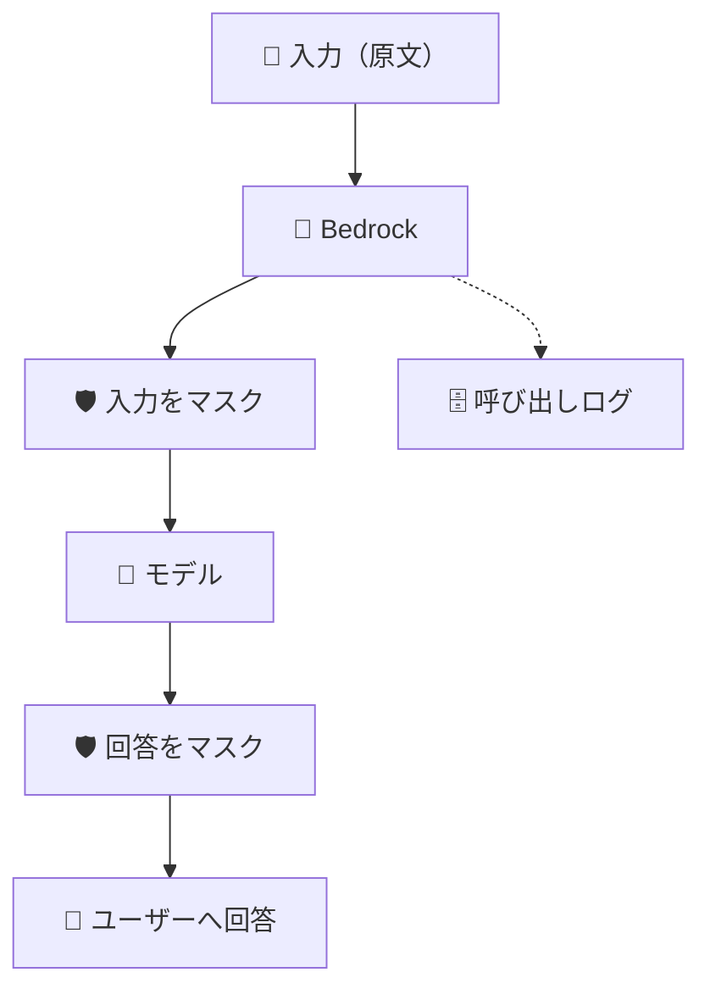
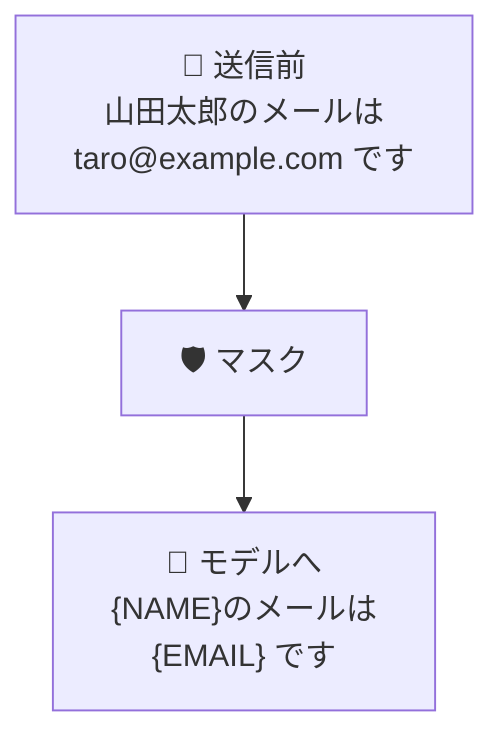
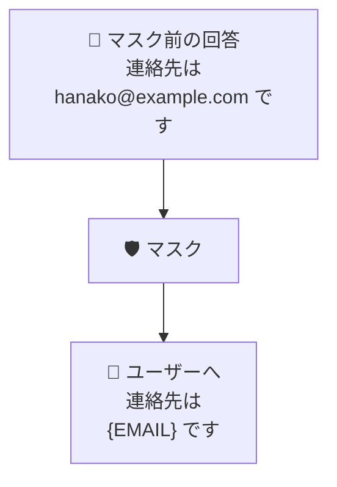

> **2026年10月9日（日本時間）時点**のAWS公式ドキュメントに基づく備忘録です。仕様は変わる可能性があります。

最近、仕事でAmazon Bedrockを設定することになりました。そこでまず気になったのが、個人情報の扱いです。社内のルールで、入力された個人情報がシステムに保存されると、セキュリティ審査が厳しくなります。最初から保存しない形にできないかと考えました。

調べてみると、Bedrockには「ガードレール」という機能があると知りました。これで個人情報をマスクすれば、保存も防げるのでは？と思ったのですが、そう単純ではありませんでした。モデルに渡す入力はマスクできても、**モデル呼び出しログには元の入力が残り得ます**。

この記事では、ガードレールで隠せる範囲と、Bedrockのログに個人情報を残さないための設定を、備忘録としてまとめます。

## まず結論

| データの流れ | ガードレールを有効にすると？ |
| --- | --- |
| ユーザー → モデル | 入力中の個人情報をマスクできる |
| モデル → ユーザー | 回答中の個人情報をマスクできる |
| ユーザー → Bedrockの呼び出しログ | ログを有効にすると、指定したCloudWatch LogsのロググループかS3バケットに**入力の原文**が記録される |

つまり、**ガードレールでモデルへの入力をマスクしても、Bedrockのログまでマスクされるわけではありません**。なお、個人情報の検出に漏れがないという保証もありません。[^sensitive]

## データはどこを通るのか

点線は、Bedrockの「モデル呼び出しログ記録」を有効にした場合だけ発生します。この設定は初期状態では無効です。[^logging]

### Bedrockのログはどこに保存される？

日本語表示のAmazon Bedrockコンソールでは、左側のメニューから「設定」を開き、「モデル呼び出しログ記録」を有効にします。続いて、ログの保存先として次のいずれかを選びます。[^logging]

- **Amazon S3のみ**：指定したバケットに圧縮JSONのログを保存。
- **CloudWatch Logsのみ**：指定したロググループ内のログイベントに保存。
- **Amazon S3とCloudWatch Logsの両方**：両方へ出力。

**保存先を選んでログを有効にする場所は、CloudWatch LogsもS3もBedrockの設定画面です。** IAMでログのオン・オフを設定するわけではありません。CloudWatch Logsへ出す場合、Bedrockがロググループへ書き込めるIAMロールが別途必要です。S3へ出す場合は、Bedrockがバケットへ書き込めるバケットポリシーが必要です。AWS公式手順では、設定者に所定のS3権限があれば、バケットポリシーは設定時に自動で追加されると説明しています。[^logging]

例えばCloudWatch Logsを選び、ロググループを`/aws/bedrock/my-invocations`と名付ければ、そこにログが入ります。この名前は例で、固定名ではありません。CloudWatch Logsを選んでも、大きな本文の保存先としてS3を別途設定する構成があります。[^logging]

### ① モデルへの入力と回答はマスクできる

**入力側：ユーザー → モデル**

**出力側：モデル → ユーザー**

例えば「山田太郎のメールはtaro@example.comです」と入力したとします。対象の個人情報を検出し、入力側のマスクを設定していれば、モデルには氏名やメールアドレスを`{NAME}`や`{EMAIL}`へ置き換えて渡せます。出力側にも設定すれば、回答中の個人情報もマスクできます。`BLOCK`を選べば、内容をブロックすることもできます。[^sensitive]

ただし、**元の入力はBedrockのガードレール（AWSサーバー）には届きます**。「AWSへ送る前に個人情報を消したい」場合は、送信する側で先にマスクします。

検出は確実ではありません。日本固有の番号や社内番号などは、対応するPII種類を確認し、必要ならカスタム正規表現や送信前のチェックを追加します。[^sensitive]

> **補足：Bedrockのモデルはどこで動く？**  
> Bedrockでは、Amazon NovaなどのAWS製モデルと、Claudeなど外部企業が開発したモデルを利用できます。外部モデルも提供会社のAPIへ入力を転送するのではなく、AWSが所有・運用する専用環境に配置されます。そのため、モデル提供会社はBedrockの入力や回答にアクセスできません。第三者モデルの一部はAWS Marketplace経由で課金されます。契約や料金の仕組みはモデルによって異なります。[^deployment][^billing]

### ② 呼び出しログには原文が残る

AWSは、ガードレールを適用しても、CloudWatch Logsのモデル呼び出しログの`input`には次の内容が入ると明記しています。[^sensitive]

> 「Amazon CloudWatch Logs の `input` フィールドには、ガードレールの介入に関係なく、常に変更されていない元のリクエストが含まれます。」

これは、**ガードレールが入力をマスクまたはブロックした場合でも、モデル呼び出しログの`input`には加工前のリクエスト原文が記録される**という意味です。モデルに渡される入力がマスクされても、ログまでマスクされるわけではありません。ガードレールのトレースにある`match`も元のPIIを含み得ます。[^sensitive]

ただし、モデル呼び出しログは最初から保存されるわけではありません。AWSは次のように書いています。[^logging]

> 「モデル呼び出しログ記録はデフォルトで無効になっています。」

「モデル呼び出しログはデフォルトでは無効」です。有効にしたときは、CloudWatch Logs、S3、または両方に入力・出力などを記録できます。AWSは両保存先のログ形式について、こう説明しています。[^logging]

> 「形式は、CloudWatch Logs と Amazon S3 の送信先の両方で同じです。」

「CloudWatch LogsとS3で形式は同じ」です。AWSが「原文」と明記しているのはCloudWatch Logsについてですが、**同じ形式で保存するS3の呼び出しログにも原文が含まれ得る**と考えるのが妥当です。これは公式文書を組み合わせた推論です。[^logging]

なお、CloudWatch Logsを選んでも、大きな本文などの保存先にS3を設定していれば、そのデータはS3へ送られます。[^logging]

## CloudWatch Logsにはログの個人情報を隠す機能がある

CloudWatch Logsには「データ保護ポリシー」という機能があります。Bedrockの呼び出しログを保存するロググループに設定すると、メールアドレスなどの機密情報を検出し、権限のない利用者がログを見るときにマスクできます。[^cloudwatch]

ただし、これは保存された原文を削除する機能ではありません。AWSは次のように書いています。[^cloudwatch]

> 「マスクされていないデータを閲覧できるのは、`logs:Unmask` IAMアクセス許可を持つユーザーのみです。」

`logs:Unmask`権限を持つ人には元の値が見えます。つまり、**画面で隠す機能であって、原文を保存しない機能ではありません**。設定前のログには遡って適用されず、S3へ直接保存したデータも対象外です。[^cloudwatch]

呼び出しログに原文を残したくないなら、**ログを有効にしない**か、**Bedrockへ送る前に入力をマスクする**ことを検討します。

## 「学習に使われない」ならガードレールは不要？

AWSのAmazon Bedrock紹介ページは、Bedrockがデータをモデル学習に使用しないと説明しています。文言は次のとおりです。[^faq]

> 「Bedrock は、モデルのトレーニングを行うためにデータを保存または使用することはなく」

それでもガードレールには意味があります。**「学習に使わない」と「回答やログから漏れない」は別**だからです。具体的には、次のような情報漏洩を防ぐのに役立ちます。

- 顧客との会話を要約する前に、不要な氏名やメールアドレスを入力側でマスクする。
  - **理由：** モデルにはマスク後の文章が渡るため、回答に同じ氏名やメールアドレスが再び出てくる可能性を下げられます。
- モデルの回答に個人情報が含まれていたら、出力側でマスクする。
  - **理由：** ユーザーの画面に表示される前に隠せるため、そのままメールへ転記したり、ファイルに保存してGitへ上げたりする事故を防ぎやすくなります。
- AWSアクセスキーなどを誤って入力したらブロックする。
  - **理由：** モデルへ渡る前に処理を止められます。ただし、モデル呼び出しログを有効にしている場合は、ログに入力の原文が残り得ます。

ただし、ツール呼び出しの引数やツールの結果は、このフィルターの対象外です。AIにファイルを書かせてGitへ上げる運用なら、コミット内容の検査も必要です。[^sensitive]

また、**「呼び出しログが無効＝AWS側にも一切保持されない」ではありません**。AWS側の推論データ保持は別の設定とモデルごとの条件で決まります。公式文書には、次の注意書きがあります。[^retention]

> 「`store=false`を設定しても、データ保持がゼロであるとは限りません。」

「`store=false`でもゼロ保持は保証されない」という意味です。保存を禁止する要件がある場合は、対象モデルの保持設定も確認します。[^retention]

## 何を設定すればいい？

目的ごとに対策を選びます。

| 目的 | 対策 |
| --- | --- |
| モデルに個人情報を渡したくない | 入力側のガードレール。AWSへの送信自体を避けるなら送信前にマスク |
| 回答で個人情報を見せたくない | 出力側のガードレールと、ツール出力・ファイル内容の検査 |
| Bedrockのログに原文を残したくない | モデル呼び出しログを有効にしない。またはBedrockへ送る前に入力をマスク |
| ログを見る人に原文を見せたくない | CloudWatch Logsのデータ保護と閲覧権限 |
| AWS側でも保持させたくない | 対象モデルのデータ保持モード |

覚えておきたいのは一つだけ。**ガードレールでマスクしても、ログに残る原文まで消えるわけではない**、ということです。

## 参照したAWS公式ドキュメント

[^sensitive]: [機密情報フィルターを使用して会話から PII を削除する — Amazon Bedrock](https://docs.aws.amazon.com/ja_jp/bedrock/latest/userguide/guardrails-sensitive-filters.html)。入力・出力のマスク、モデル呼び出しログとトレースの例外、ツール利用時の対象外を確認。
[^logging]: [CloudWatch Logs と Amazon S3 を使用してモデル呼び出しをモニタリングする — Amazon Bedrock](https://docs.aws.amazon.com/ja_jp/bedrock/latest/userguide/model-invocation-logging.html)。コンソールでの設定手順、デフォルト設定、保存先、ログ形式、S3への大容量データ保存を確認。
[^cloudwatch]: [機密性の高いログデータをマスキングで保護する — Amazon CloudWatch Logs](https://docs.aws.amazon.com/ja_jp/AmazonCloudWatch/latest/logs/mask-sensitive-log-data.html)。閲覧・転送時のマスク、`logs:Unmask`、既存ログへの非遡及を確認。
[^faq]: [Amazon Bedrock — AWS](https://aws.amazon.com/jp/bedrock/)。入力データをモデルのトレーニング目的で保存・使用しないことを確認。
[^retention]: [データ保持 — Amazon Bedrock](https://docs.aws.amazon.com/ja_jp/bedrock/latest/userguide/data-retention.html)。AWS側の推論データ保持が、モデル・設定によって異なる点を確認。
[^deployment]: [データ保護 — Amazon Bedrock](https://docs.aws.amazon.com/ja_jp/bedrock/latest/userguide/data-protection.html)。モデルはAWSが所有・運用するModel Deployment Accountへ配置され、モデル提供元はその環境や入力・出力へアクセスできないことを確認。
[^billing]: [モデルへのアクセスをリクエストする — Amazon Bedrock](https://docs.aws.amazon.com/ja_jp/bedrock/latest/userguide/model-access.html)。第三者モデルのAWS Marketplace購読とEULAを確認。
