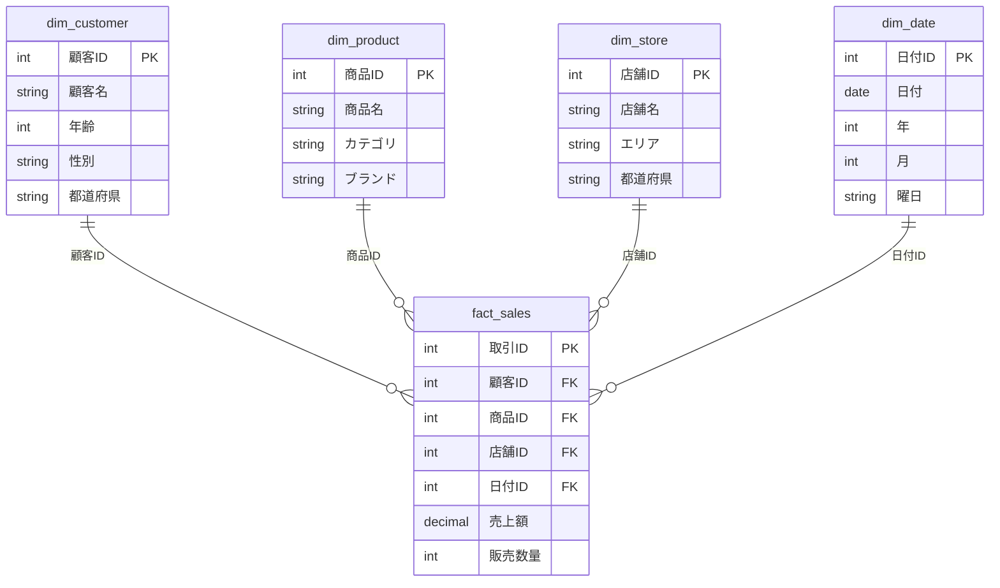
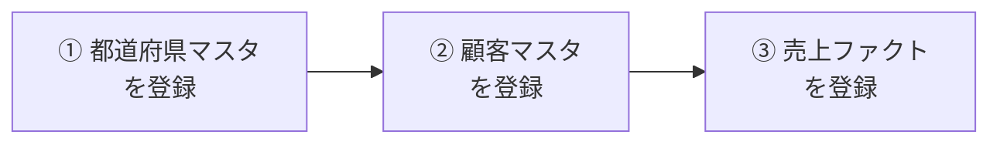

データ基盤を設計する際、「データをどのような構造（スキーマ）で保存するか」は、分析のスピード・正確性・運用コストのすべてに影響を与える重要な設計判断です。

本記事では、データウェアハウス（DWH）の設計手法として長年使われてきた **ディメンショナルモデリング** について、その基本概念から、スタースキーマとスノーフレークスキーマの使い分け、そして現代のデータ基盤における実務上のベストプラクティスまでを体系的に解説します。

## 🧊 ディメンショナルモデリングとは

ディメンショナルモデリング（Dimensional Modeling）は、DWHやデータマートの設計において広く使われるデータモデリング手法です。ラルフ・キンボール（Ralph Kimball）氏によって提唱されました。

通常のリレーショナルデータベース設計（正規化）が **「データの重複を排除し、整合性を保つこと」** を最優先するのに対し、ディメンショナルモデリングは **「ビジネスユーザーにとって直感的に理解しやすく、集計クエリを高速に実行できること」** を目的として設計されています。

:::message
**正規化とディメンショナルモデリングの違い**

業務システム（オンライン処理）のデータベースは、データの重複を排除する「正規化」が基本です。一方、分析用途のDWHでは、クエリの速度とわかりやすさを優先するため、あえてデータの重複を許容する「非正規化」の設計を行います。ディメンショナルモデリングは、この「分析に特化した非正規化の設計手法」です。
:::

### 🧩 2つの構成要素：ファクトとディメンション

ディメンショナルモデリングは、以下の2種類のテーブルで構成されます。

| 種別 | 役割 | 格納するデータの例 |
|---|---|---|
| **ファクトテーブル（Fact Table）** | ビジネスで発生した「事実（イベント）」を記録する | 売上金額、販売数量、アクセス数などの **数値データ（メジャー）** |
| **ディメンションテーブル（Dimension Table）** | ファクトを「どの切り口で分析するか」という属性を記録する | 顧客名、商品カテゴリ、店舗の所在地、日付の詳細（年・月・曜日）などの **テキスト・属性データ** |

「誰が（顧客）、いつ（日付）、どこで（店舗）、何を（商品）、いくら買ったか（売上額）」という、人間の思考に近い構造になっているのが特徴です。
以下ファクトテーブル（上の1種）とディメンションテーブル（下の4種）の例を示します。



#### 🔢 ファクトテーブルの特徴

ファクトテーブルは、ビジネスプロセスで発生した「計測可能な事実」を記録するテーブルです。

- 売上額、販売数量などの **数値データ（メジャー）** を中心に保持する
- 各ディメンションテーブルと紐付けるための **外部キー（FK）** を持つ
- 一般的に、ディメンションテーブルよりも **行数が圧倒的に多い**（数百万〜数十億行）
- 1行が1つのビジネスイベント（1回の購入、1回のアクセスなど）に対応する

:::message
**💡 補足：業務システムの「トランザクションデータ」との違い**
トランザクションデータは「日々の業務を正しく処理・更新するため」のものですが、ファクトテーブルは「大量データの集計を高速に行うため」に最適化された履歴データです。
:::

#### 🏷️ ディメンションテーブルの特徴

ディメンションテーブルは、ファクトの数値を「どの切り口で集計・フィルタするか」という **分析軸** を提供するテーブルです。

- 顧客名、商品カテゴリ、店舗名などの **記述的・説明的なテキストデータ** を中心に保持する
- ファクトテーブルに比べて **行数は少ない**（数百〜数百万行程度）
- 1行が1つのエンティティ（1人の顧客、1つの商品など）に対応する

:::message
**💡 補足：業務システムの「マスタデータ」との違い**
マスタデータは「データ更新時の矛盾を防ぐために正規化（分割）されたもの」ですが、ディメンションテーブルは「分析時の結合（JOIN）を減らして直感的に検索できるよう、あえて非正規化（まとめる）されたもの」です。
:::

### 💡 なぜディメンショナルモデリングが使われるのか

ディメンショナルモデリングが広く採用されている理由は、大きく3つあります。

- **直感的にわかりやすい：** 「中心にある数値データ（ファクト）を、周囲の属性データ（ディメンション）で切って分析する」という構造が、ビジネスの問いかけ（「東京都の店舗で、食品カテゴリの売上はいくらか？」）にそのまま対応する
- **集計クエリが速い：** 正規化されたスキーマと比べてテーブルの結合（JOIN）回数が少なく、大量データの集計処理を高速に実行できる
- **拡張しやすい：** 新しい分析軸（たとえば「キャンペーン」ディメンション）を追加したい場合、既存のファクトテーブルに外部キーを1つ追加するだけで済み、既存の構造を壊さずに拡張できる

## ⚖️ スタースキーマとスノーフレークスキーマ

ディメンショナルモデリングで構築されるスキーマには、**スタースキーマ**と**スノーフレークスキーマ**の2つの代表的な構造があります。両者の違いは **ディメンションテーブルを正規化するかどうか** にあります。

### ⭐ スタースキーマ（Star Schema）

中心に1つのファクトテーブルがあり、その周囲に複数のディメンションテーブルが **直接** 結合された構造です。星（Star）のような見た目になることからこの名前がついています。

ディメンションテーブルは正規化せず、あえてデータを冗長に持たせます。

```text
                           ┌──────────┐
                           │ dim_date │
                           └────┬─────┘
                                │
  ┌──────────────┐       ┌──────┴──────┐       ┌─────────────┐
  │ dim_customer ├───────┤ fact_sales  ├───────┤ dim_product │
  └──────────────┘       └─┬─────────┬─┘       └─────────────┘
                           │         │
             ┌─────────────┴┐       ┌┴────────────┐
             │  dim_store   │       │dim_promotion│
             └──────────────┘       └─────────────┘
```

**顧客ディメンションテーブルの例（スタースキーマ）：**

| 顧客ID | 顧客名 | 年齢 | 性別 | 都道府県 |
|---|---|---|---|---|
| A01 | 山田 | 30 | 男性 | 東京都 |
| B02 | 佐藤 | 25 | 女性 | 神奈川県 |
| C03 | 田中 | 45 | 男性 | 東京都 |

「東京都」「男性」といった属性データが繰り返し保存されます。データの冗長性は増しますが、JOIN（結合）なしで「顧客の属性」にすぐアクセスできるのがメリットです。

https://www.databricks.com/jp/blog/what-is-star-schema

### ❄️ スノーフレークスキーマ（Snowflake Schema）

スタースキーマのディメンションテーブルを、さらに細かく **正規化（分割）** した構造です。雪の結晶（Snowflake）のように枝分かれしていく見た目になります。

```text
                            ┌──────────┐    ┌───────────┐
                            │ dim_date ├────┤ dim_month │
                            └────┬─────┘    └───────────┘
                                 │
  ┌──────────────┐        ┌──────┴──────┐        ┌─────────────┐    ┌────────────┐
  │ dim_customer ├────────┤ fact_sales  ├────────┤ dim_product ├────┤dim_category│
  └──────┬───────┘        └──┬───────┬──┘        └──────┬──────┘    └────────────┘
         │                   │       │                  │
  ┌──────┴───────┐    ┌──────┴─────┐ │           ┌──────┴─────┐
  │dim_prefecture│    │ dim_store  │ │           │ dim_brand  │
  └──────────────┘    └──────┬─────┘ │           └────────────┘
                             │       │
                      ┌──────┴─────┐ │
                      │ dim_region │ │
                      └────────────┘ │
                                     │
                          ┌──────────┴─────┐    ┌──────────────┐
                          │ dim_promotion  ├────┤dim_promo_type│
                          └────────────────┘    └──────────────┘
```

**顧客の都道府県を取得する場合（スノーフレークスキーマ）：**

「顧客テーブル」→「都道府県テーブル」と、正規化された別テーブルへのJOINを経由する必要があります。（※さらに階層を細かく分離している場合は複数回のJOINが必要になります）

```sql
-- スノーフレークスキーマで顧客の都道府県名を取得するクエリ
SELECT c.顧客名, p.都道府県名
FROM dim_customer c
JOIN dim_prefecture p ON c.都道府県ID = p.都道府県ID
```

```sql
-- スタースキーマなら1テーブルで完結する
SELECT 顧客名, 都道府県名
FROM dim_customer
```

https://www.databricks.com/jp/blog/what-is-snowflake-schema

### 🆚 メリット・デメリット比較

| 比較項目 | スタースキーマ | スノーフレークスキーマ |
|---|---|---|
| **クエリの速度** | ✅ 速い（JOINが最小限） | ❌ 遅くなりやすい（JOINが多い） |
| **わかりやすさ** | ✅ テーブル数が少なく直感的 | ❌ テーブル数が多く複雑 |
| **BIツールとの相性** | ✅ 非常に良い | ❌ 設定が煩雑になりやすい |
| **データの冗長性** | ❌ 多い（同じ文字列が重複保存される） | ✅ 少ない（IDで紐付け） |
| **データ更新の安全性** | ❌ 変更時に複数行の更新が必要 | ✅ マスタの1行を更新するだけで済む |
| **ストレージ容量** | ❌ 多く消費する | ✅ 節約できる |
| **ETLパイプラインの複雑さ** | ✅ シンプル（依存関係が少ない） | ❌ 複雑（書き込み順序の制御が必要） |

### 👥 誰がどちらのスキーマを喜ぶのか

BI・データ活用側とデータ管理側では、スキーマに対する「喜びのポイント」が異なります。

#### 📊 BI・活用側 → スタースキーマを好む

BIツールを使うアナリストやビジネスユーザーにとっては、**「使いやすさ」と「速さ」** が最重要です。

- テーブルの数が少なく、データ構造を直感的に理解できる
- JOINが最小限のためクエリが速い
- Tableau、Power BIなどの主要BIツールがスタースキーマを前提に設計されている

#### 🗄️ データエンジニア（DE） → スノーフレークスキーマを好む

データを管理・保守する立場では、**「データの整合性」と「管理のしやすさ」** が重要になります。

- マスタデータが1箇所にまとまるため、名称変更時も1行の更新で済む
- 重複データがなく、データの不整合が起きにくい
- ストレージ容量を節約できる

#### 🛠️ データエンジニアの実感 → 実はスタースキーマの方が楽な部分もある

:::message
**実はデータエンジニアにとっても、スタースキーマの方が運用が楽になるケースが多い**のが実態です。

スノーフレークスキーマの場合、ETLパイプラインにおいてテーブル間の **外部キー制約** を意識する必要があり、データの書き込み順序（依存関係）を厳密に制御しなければなりません。
:::

スノーフレークスキーマでは、各テーブルがID（外部キー）で紐づいているため、データの書き込み順序を間違えるとエラーになります。

たとえば、新しい顧客「山田さん（30歳、東京都）」のデータをETLパイプラインで取り込むケースを考えます。

```text:スノーフレークスキーマのテーブル構造
都道府県マスタ:  [ID: 13, 名前: 東京都]
顧客マスタ:      [顧客ID: A, 氏名: 山田, 都道府県ID: 13]  ← 都道府県IDが先に存在している必要がある
```

ETLパイプラインは以下の **厳密な順序** で処理を実行しなければなりません。



この依存関係をAirflowなどのワークフロー管理ツールで厳密に制御し、途中で1つでもジョブが失敗した場合のリカバリ処理も設計する必要があります。
私が携わったプロジェクトでも、データの種類が徐々に増え、それに伴いテーブル数が増えるにつれて、ETLパイプラインが複雑化し、管理が煩雑になっていった経験があります。

一方、スタースキーマなら「顧客ディメンションに1行書き込むだけ」で完了するため、ETLパイプラインの設計が劇的にシンプルになります。

## 👑 現代のデータ基盤ではスタースキーマが主流

現代のデータ分析基盤（BigQuery、Snowflake、DatabricksなどのクラウドDWH / データレイクハウス）において、**スタースキーマを採用するのが圧倒的に主流**となっています。

- **ストレージが安い：** スノーフレークスキーマの「容量節約」メリットの価値が相対的に低下した。クラウドDWHの普及でストレージ単価が劇的に下がった現在では、多少の重複は許容される
- **分析者の生産性が最優先：** データエンジニアのミッションが「DBを綺麗に保つこと」から「ビジネス側がいかに速くデータを使えるようにするか」に変化した
- **BIツールとの相性：** 主要なBIツール（Tableau、Power BIなど）がスタースキーマに最適化されている
- **ETLパイプラインの運用が楽：** 前述の通り、データの書き込み順序を気にする必要がない

## 🍱 補足：One Big Table（OBT）という選択肢

スタースキーマの考え方をさらに推し進めた手法として、近年注目を集めているのが **One Big Table（OBT）** です。

### 📖 OBTとは？

OBTは、スタースキーマのファクトテーブルとディメンションテーブルを **あらかじめ全てJOINして1つの巨大なテーブルとして保存したもの** です。数十〜数百のカラム（列）を持つ、非常に横に広いテーブルになります。

```text:OBTのイメージ
[取引ID] [売上額] [顧客ID] [顧客名] [年齢] [都道府県] [店舗ID] [店舗名] [商品ID] [カテゴリ] ...
  001      5000     A01     山田     30     東京都     S01     渋谷店    I01     日用品   ...
  002      3000     B02     佐藤     25     神奈川県   S02     横浜店    I02     食品     ...
  003      1500     A01     山田     30     東京都     S01     渋谷店    I02     食品     ...
  004      8000     C03     田中     45     東京都     S03     新宿店    I03     家電     ...
  005      2000     A01     山田     30     東京都     S02     横浜店    I01     日用品   ...
```

### 🎭 ユーザーとデータエンジニア視点のOBT

この巨大なテーブルに対する受け止め方は、立場によって真逆になります。

- **BI・機械学習などの活用する側：嬉しい**😊
    - JOINが不要で直感的にドラッグ＆ドロップできる
    - そのままMLの学習データに使える
- **データを加工・管理するDE側：管理が大変**💦
    - データの重複がすさまじい（特定の顧客名、都道府県名が複数存在する）
    - マスタデータに変更があった際、数千万行の更新が必要になる

### 🚀 なぜOBTが近年普及したのか？
- **クラウドDWH（BigQuery等）の普及☁️**
    - Google BigQueryやSnowflakeなどの列指向（カラムナー）データベースは、特定の列を高速にスキャン・集計するのが得意です。一方で、巨大なテーブル同士のJOINはネットワークやメモリのコストが高くつくため、あらかじめJOINした状態（非正規化）で保存するパターンが増えました。
- **ストレージコストの劇的な低下💰**
    - 過去のオンプレミス環境では、高価なディスク容量を節約するために正規化（重複排除）が必須でした。しかしクラウドストレージの単価が劇的に下がった現在、「多少ストレージ代を余分に払ってでも、コンピュートリソース（計算コスト）や人間の分析時間を節約する」というパラダイムシフトが起きました。
- **セルフサービス分析・データ民主化の需要📈**
    - データエンジニアだけでなく、ビジネス職（マーケターや営業など）がTableauやLookerなどのBIツールを使って自らデータ探索を行う機会が増えました。データ構造やJOINの知識がなくても、1つのテーブルからドラッグ＆ドロップするだけで直感的に集計ができるOBTは、この需要に完璧にマッチしています。

### 🔍 OBTのメリットとデメリット

| 観点 | 内容 |
|---|---|
| ✅ **クエリが爆速** | JOINが一切不要なため、列指向DWHの長所を最大限に活かせる |
| ✅ **SQLが極限までシンプル** | `SELECT SUM(売上額) FROM obt_sales WHERE 都道府県 = '東京都'` だけで完結する |
| ✅ **セルフサービス分析に最適** | JOINを知らないビジネスユーザーでも、1テーブルからドラッグ＆ドロップで分析できる |
| ✅ **機械学習にそのまま使える** | 2次元の平らな表としてそのままモデルの学習データになる |
| ❌ **ストレージ容量の増大** | 同じ属性データが何百万行にもわたって重複保存される |
| ❌ **データ更新時のコストが高い** | 属性が変わった場合、該当する全行を書き換える必要がある |
| ❌ **カラムの肥大化** | 数百カラムに達することもあり、管理が煩雑になりやすい |

:::message
OBTはスタースキーマの「代替」ではなく、**スタースキーマをベースに構築されたデータマート（最終的な分析用テーブル）の一形態**として捉えるのが適切です。「データウェアハウス内ではスタースキーマでデータの整合性を保ち、最終的にBIツールから参照されるテーブルだけをOBTにする」という使い分けが実務では多く見られます。
:::

https://medium.com/dbsql-sme-engineering/one-big-table-vs-dimensional-modeling-on-databricks-sql-755fc3ef5dfd

## 📝 まとめ

ディメンショナルモデリングは、データウェアハウスにおけるデータ設計のデファクトスタンダードです。

- **ファクトテーブル** に数値データ（売上額など）を、**ディメンションテーブル** に分析軸の属性データ（顧客名、商品名など）を格納する
- スキーマの構造には **スタースキーマ**（非正規化）と **スノーフレークスキーマ**（正規化）の2種類がある
- 現代のクラウドDWH環境では、クエリパフォーマンス・わかりやすさ・運用のしやすさから **スタースキーマが主流**
- スタースキーマをさらに推し進めた **One Big Table（OBT）** も、データマートの選択肢として注目されている

ディメンショナルモデリングの考え方を理解しておくことは、データ基盤の設計に関わるすべてのエンジニアにとって必須の知識と言えます。

