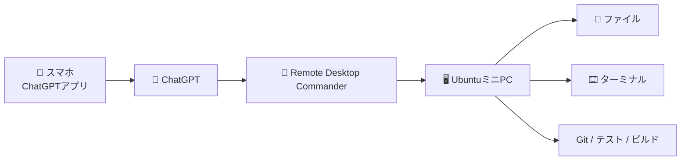
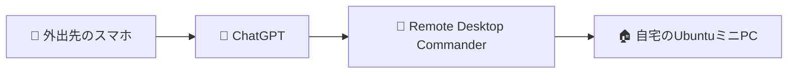
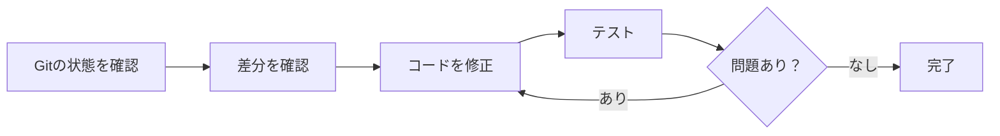
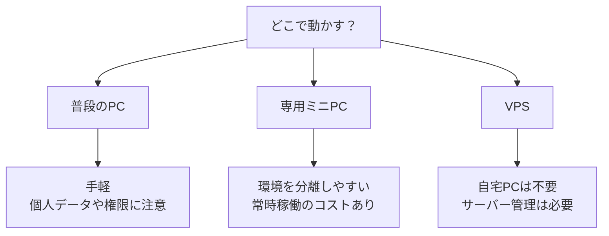
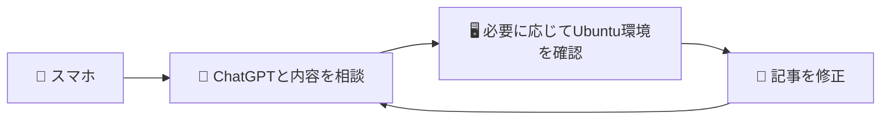

最近、**ChatGPT × Remote Desktop Commander × UbuntuミニPC × スマホ**という構成で開発しています。

やっていることはシンプルです。スマホからChatGPTに指示を出し、自宅で動かしているUbuntuミニPC上のファイル確認、コマンド実行、コード修正、テストなどを進めてもらいます。

実際に、次の2サイトもこの構成を使って開発しています。

- [公共データ可視化サイト「DATLUME」](https://datlume.com/)
- [無料Web便利ツール集](https://utility-tools-jp.com/)

ちなみに、**この記事自体もスマホでChatGPTと話しながら作っています。**

<!-- TODO: スマホ版ChatGPTからRemote Desktop Commanderを使っている画面を追加 -->

## Remote Desktop Commanderとは？

Remote Desktop Commanderは、ChatGPTなどのAIから、自分のPCにあるファイルやターミナルを操作できるようにする仕組みです。

普通のリモートデスクトップのように、スマホの小さな画面でPCを直接操作するわけではありません。

「Gitの状態を確認して」「テストを実行して」「エラーの原因を調べて」のようにChatGPTへ伝えると、Remote Desktop Commander経由でPC側の作業を進められます。

イメージとしては、**ChatGPTから普段使っている開発環境に手を伸ばせるようにする**感じです。

## 外出先からでも使える

便利なのは、スマホとUbuntuミニPCが**同じWi-FiやLANにつながっている必要がない**ことです。

スマホもPCもインターネットには接続されている必要がありますが、自宅LANにVPNで入ってから操作する、といった使い方ではありません。

外出先からでも、たとえば「開発中のサイトのGitの状態を確認して」「テストを回して、失敗していたら原因を調べて」といった指示を出せます。

## 実際の使い方

普段は、こんな流れで作業を頼んでいます。

感覚としては、**スマホのChatGPTから自宅PC上のCodex的な作業を頼める**のに近いです。

もちろん、全部を任せる必要はありません。「状態だけ確認」「原因調査まで」「修正とテストまで」のように区切って使えます。

<!-- TODO: ChatGPTにGit確認やテストを頼んでいる実際の画面を追加 -->

## 実際に作ったもの

### DATLUME

[DATLUME](https://datlume.com/) は、日本の公共データを複数の角度から可視化するサイトです。データ収集・加工、フロントエンド修正、テストなどでこの環境を使っています。

### 無料Web便利ツール集

[無料Web便利ツール集](https://utility-tools-jp.com/) は、CSV/JSON変換など、ブラウザで使える小さなWebツールをまとめたサイトです。こちらも機能追加やUI修正、テストなどをスマホから指示して進めることがあります。

<!-- TODO: DATLUMEと無料Web便利ツール集のトップ画面を追加 -->

## 無料枠がかなり大きい

Remote Desktop Commanderは、執筆時点でFreeプランが**月10,000 tool calls**、Proが**月20ドルでtool call無制限**です。

最初は無料枠で使っていましたが、使用頻度がかなり増えたので現在はProを契約しています。

料金は変わる可能性があるので、最新情報は[公式のPricingページ](https://desktopcommander.app/pricing/)を確認してください。

<!-- TODO: 料金画面のスクリーンショットを追加。契約情報など不要部分はトリミング -->

## ChatGPT Plusとの組み合わせ

ChatGPT側はPlusを使っています。執筆時点でPlusは**月20ドル**です。

APIのように使ったトークン量に応じて毎回課金される方式ではなく、月額プランの範囲で使えます。ただし、モデルや機能ごとに利用上限が設定される場合はあります。

重めのコード調査や長めの作業では、現在はGPT-5.6 Solを使っています。PlusではGPT-6 AstraもChatGPT Work / Codexで利用できますが、こちらは利用枠があります。モデル構成や利用上限は変化が速いので、公開時には[ChatGPT Plusの公式情報](https://help.openai.com/ja-jp/articles/6950777-what-is-chatgpt-plus)を再確認するのがよさそうです。

## 常時稼働PCには注意

現在はUbuntuを入れたミニPCを自宅で常時稼働させています。便利ですが、**PCのファイルやターミナルをAIから操作できる**ということは、その分だけ権限の扱いも重要です。

少なくとも、次の点は意識しています。

- 普段使いのPCと開発環境をできるだけ分ける
- AIからアクセスできる範囲を必要以上に広げない
- Gitやバックアップで戻せる状態にしておく
- OSやソフトウェアを更新する

自宅PCを常時稼働させる以外にも、専用PCやVPSを使う方法があります。

VPSなら自宅PCを動かし続ける必要はありませんが、VPSだから自動的に安全というわけではありません。認証、権限、アップデートなどの管理は必要です。

どれが正解というより、用途とリスクに合わせて選ぶのがよいと思います。

## この記事もこの構成で作っている

今回の記事も、スマホからChatGPTと会話しながら作っています。

記事の構成を相談し、必要ならPC側を確認し、文章を直す。このループをスマホから回しています。

## まとめ

Remote Desktop Commanderを使い始めて変わったのは、「PCを遠隔操作できるようになった」というより、**PCの前にいなくてもChatGPTから普段の開発環境を使えるようになった**ことでした。

DATLUMEや無料Web便利ツール集の開発でも実際に使っています。

一方で、ファイルやターミナルへアクセスできる強い仕組みなので、常時稼働PC・専用ミニPC・VPSなど、それぞれの環境に合った方法を選ぶのが大事です。

まず試すだけなら無料枠も大きいので、興味があれば小さな検証環境から触ってみるのがよいと思います。
