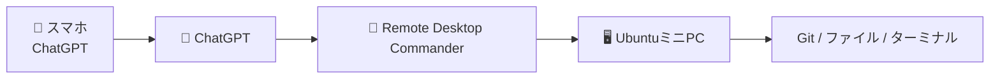
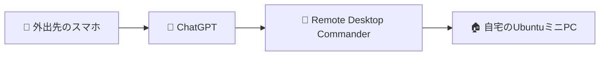
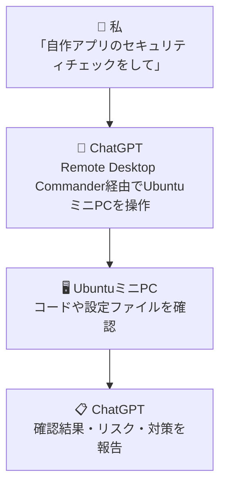
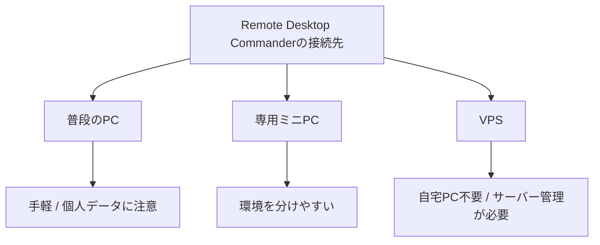

最近、**ChatGPT × Remote Desktop Commander × UbuntuミニPC × スマホ**という構成で開発しています。

スマホからChatGPTに話しかけるだけで、自宅のUbuntuミニPC上にあるコードやファイルを確認し、必要ならコマンド実行・修正・テストまで進めてもらう使い方です。

実際に、[公共データ可視化サイト「DATLUME」](https://datlume.com/) と [無料Web便利ツール集](https://utility-tools-jp.com/) も、この構成を使って開発しています。

## Remote Desktop Commanderとは？

Remote Desktop Commanderは、ChatGPTなどのAIから、自分のPC上のファイルやターミナルを扱えるようにする仕組みです。

普通のリモートデスクトップのようにスマホでPC画面を直接操作するのではなく、ChatGPTに「Gitの状態を見て」「テストして」と頼みます。

するとChatGPTがRemote Desktop Commander経由でUbuntuミニPCに接続し、必要なコマンドを実行して結果を読み取ります。たとえばGitなら現在のブランチや差分を確認し、テストなら実際にコマンドを実行して成否やエラー内容まで返してくれます。必要なら、そのまま原因調査や修正まで続けられます。

### 無料枠がかなり大きい

執筆時点では、Freeプランが**月10,000 tool calls**、Proが**月20ドルでtool call無制限**です。

最初は無料枠で使っていましたが、使う頻度が増えたので現在はProを契約しています。まず試すだけならFreeでも十分触れます。

料金は変わる可能性があるので、最新情報は[公式のPricingページ](https://desktopcommander.app/pricing/)を確認してください。

<!-- TODO: 料金画面のスクリーンショットを追加 -->

### 外出先からでも使える

スマホとPCが**同じWi-FiやLANにつながっている必要はありません**。それぞれがインターネットにつながっていれば、外出先のスマホからChatGPTに指示を出せます。

たとえば外出中に「開発中のサイトのGitの状態を確認して」と頼み、そのまま差分確認やテストまで進めてもらえます。

## 実際の使い方

使い方はかなりシンプルです。ChatGPTからRemote Desktop Commanderを使える状態にして、あとは普段どおり会話で指示します。

たとえば、自作アプリのセキュリティチェックを頼むなら、次のような流れです。

全部を任せる必要はなく、「確認だけ」「原因調査まで」「修正とテストまで」のように区切って使えます。

感覚としては、**スマホのChatGPTから自宅PC上でCodex的な作業を頼む**のに近いです。

### ChatGPT Plusとの組み合わせ

私は現在、ChatGPT側はPlusを使っています。執筆時点では月20ドルです。

APIのような従量課金ではなく月額プランなので、毎回トークン料金を気にせず使いやすいのが良いところです。ただし、モデルや機能ごとに利用上限が設定される場合はあります。

重めのコード調査ではGPT-5.6 Solを使うことが多いです。モデルや利用条件は変化が速いので、最新情報は[ChatGPT Plusの公式情報](https://help.openai.com/ja-jp/articles/6950777-what-is-chatgpt-plus)を確認してください。

### 常時稼働PCがあれば便利だが注意も必要

現在はUbuntuを入れたミニPCを自宅で常時稼働させています。外出先からでもすぐ使えるので便利ですが、いくつか注意したいことがあります。

まずセキュリティ面です。ファイルやターミナルをAIから操作できるため、権限やデータの扱いには注意が必要です。特に気をつけたいのが、**個人情報を意図せずGitにアップしてしまうリスク**です。

実際、この前ChatGPTに開発作業を任せていたとき、**自分の名前が含まれるフォルダパスや、システムで利用しているGmailアドレスが、そのままGitにアップされてしまった**ことがありました。こちらが公開するつもりのない情報でも、AIが作成・修正したファイルに紛れ込むことがあります。

そのため、Gitにコミット・プッシュする前に差分を確認し、個人情報や認証情報が含まれていないかチェックすることが大切です。一度公開した情報は、ファイルから消してもGitの履歴に残る場合があります。

また、PCを長時間つけっぱなしにする以上、発熱やホコリ、電源アダプター・電源タップの異常などによる故障や、場合によっては発煙・火災のリスクもゼロではありません。

普段使いのPCと環境を分ける、AIのアクセス範囲を必要以上に広げない、Gitやバックアップで戻せる状態にするといった対策に加えて、通気性の良い場所に置く、ホコリをためない、電源まわりを定期的に確認するといった基本的な対策も必要です。

自宅PCを常時動かしたくないなら、VPSに開発環境を用意する方法もあります。

どれが正解というわけではないので、コストやリスクに合わせて選ぶのがよいと思います。

## 実際に作ったもの

### DATLUME

[公共データ可視化サイト「DATLUME」](https://datlume.com/) は、日本の公共データをさまざまな角度から可視化するサイトです。

データ収集や加工、フロントエンド修正、テストなどで、ChatGPTとRemote Desktop Commanderを使っています。

### 無料Web便利ツール集

[無料Web便利ツール集](https://utility-tools-jp.com/) は、CSV/JSON変換など、ブラウザ上で使えるツールをまとめたサイトです。

こちらは、機能追加、UI修正、テストなど、開発のほぼすべてをスマホからChatGPTに指示して作りました。

<!-- TODO: DATLUMEと無料Web便利ツール集の画面を追加 -->

### この記事もこの構成で作っている

この記事自体も、スマホでChatGPTと話しながら作っています。

構成を相談し、必要ならPC側を確認し、記事ファイルを修正してGitへ反映するところまで、同じ仕組みを使っています。

## まとめ

Remote Desktop Commanderを使うと、スマホからChatGPTに話しかけて、自分のPC上の開発環境で作業を進められます。

便利なのは、単にPCを遠隔操作できることよりも、**PCの前にいなくても「やりたいこと」をChatGPTに伝えられること**だと感じています。

実際にDATLUMEや無料Web便利ツール集、この記事の制作でも使っています。

一方で、PCのファイルやターミナルを扱える強い仕組みでもあります。普段のPC、専用ミニPC、VPSなど、それぞれに合った環境を選びながら使うのがよさそうです。
